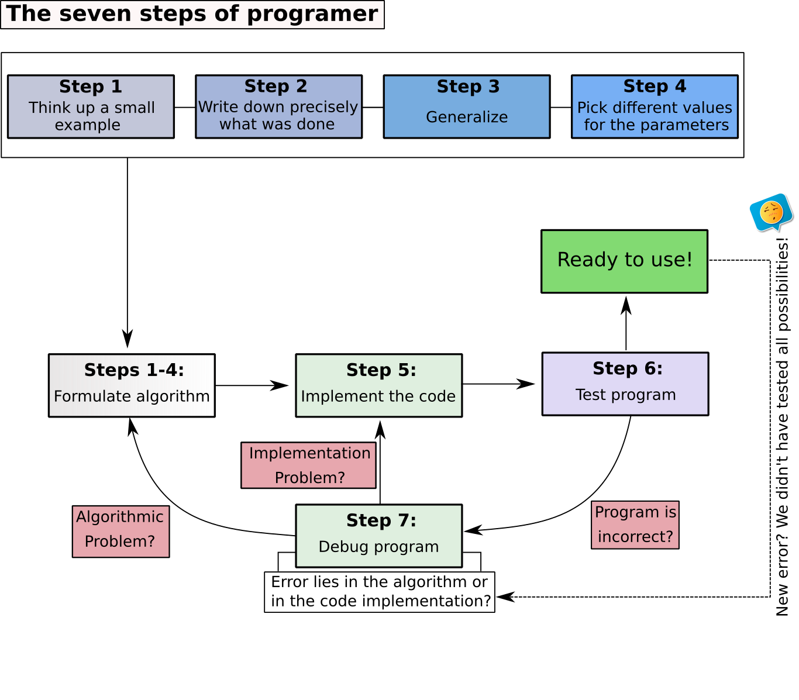

```{r setup, include=FALSE}
library(knitr)
opts_chunk$set(echo = TRUE)
```

<div class="div-1">
<div class="header1">
# Overview of the Seven Steps
</div>

The seven steps proposed by Hilton et al. (2019) is very interesting strategy to start a new project that involves programming process, where a summary of the entire process in shown in the Figure 1.

```{r,echo=FALSE,fig.cap="The seven steps (modified from Hilton et al. (2019))"}

```
All steps are then described in the sections below.

<div class="header1">
# Step 1
</div>

This is the moment where you spend time thinking about the project and how could you divide them into small tasks. Start your project drawing a diagram of it by hand, including the main subjects, how you could sorted out the problems, and how many main algorithms should you create to have your project done. Here you may include how the project could be sub-divided in smaller tasks, how this tasks are connected, and if there is an order to execute them (Figure 2). Consequently, this should reflect in the number of main algorithms to be build. Doing a good job during this stage will facilitate the remainder steps.   

```{r,echo=FALSE,fig.cap="Example of how divide the main project into small tasks"}
knitr::include_graphics('main_project.png')
```


<div class="header2">
## Example
</div>

Suppose we would want to write an algorithm in C++ to compute the total fat of a ice cream portion basis ($y$). Suppose also this response variable is a function of butyric fat $x_1$ and vegetable fat $x_2$. Let $E[y]$ be the expected value of $y$ defined as

$$E[y]=10-0.5x_1+0.6x_1^2-0.6x_2+0.2x_2^2+0.1x_1x_2$$
Thus, we can pick particular values for $x_1$, and $x_2$ to calculate the total fat $y$ by hand. If $x_{1}=2$, $x_{2}=1$, then 
$$y=10-0.5\times2+0.6\times 2^2-0.6\times 1+0.2 \times 1^2+0.1\times 2 \times 1 = 11.2.$$

Now, suppose the the second aim is optimizing reduced fat ice cream formulation from this fitted model. In this sense, we are looking for the global minimum through the response surface, consequently, we can divide our project into, e. g., two tasks:

<div class="div-2">
1. Generalize the function for any $x_1$ and $x_2$; 
2. Calculate the global (or absolute) minimum point;
</div>

If you get stuck in one of these steps, probably this difficult is comming from a lack of domain knowledge of a particular field, e. g., a lack of domain in mathematics:

<div class="div-2">
* How could I calculate the global minimum? 
* How can I use partial derivatives?
</div>

Thus, during this step you have to identify all lack of domain knowledge and then overcome them before going to the next step. Sometimes, domain knowledge may come from particular fields of computer science, sports, agriculture, statistics, or engineering.
</div>

<div class="header1">
# References
</div>

<p align="justify">
[1] Hilton, AD; Lipp, GM; Rodger, SH, Translation from Problem to Code in Seven Steps, Comped 2019 Proceedings of the Acm Conference on Global Computing Education (2019), pp. 78-84. 
</p>


**Did you find this page helpful? Consider sharing it 🙌**


<style>
.div-1 {
  text-align: justify;
}
.div-2{
  text-align: justify;
  background-color: #d6edd3;
}
.header1 h1{
font-style: normal;
color: #3715d1;
}
.header2 h2{
font-style: normal;
color: #3f3669;
}
</style>
