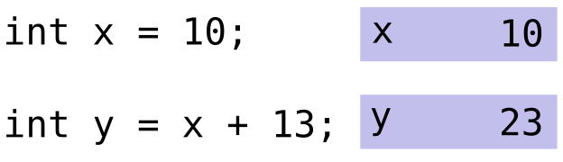
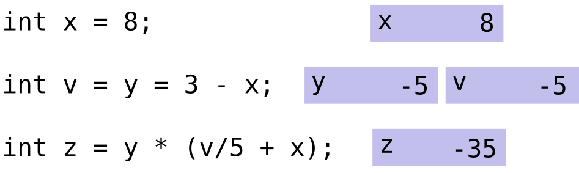
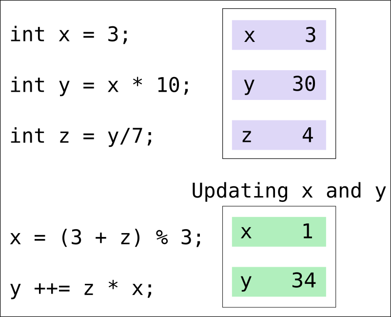
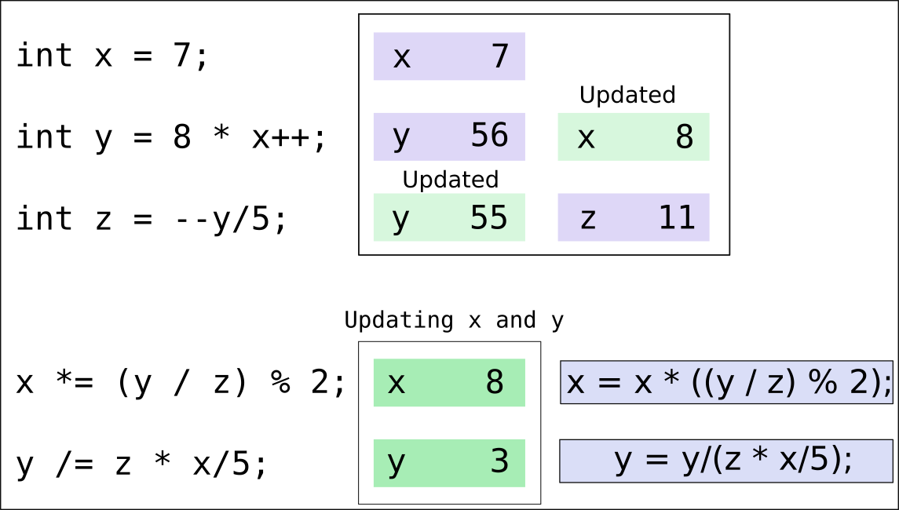

# Introduction

Expressions are combinations of operators, values (constants), and variables arranged according to the rules established throughout the code. Thus, every expression is any part of a statement that returns a value, as in the following example: 

```{r,echo=FALSE, out.width = "320px", fig.align='center'}

```

This statement creates a box to store the value of $x$ and another to keep the value of $y$ equal to the expression $x$ plus 13 ($y=23$). Now consider a more complex statement:

```{r,echo=FALSE, out.width = "500px", fig.align='center'}

```

This statment consists of three expressions:
<div class="div-1">
* The results of the expression $3 - x$ is stored in the variable $y$
* The expression $y = 3 - x$ returns the value of $y$, and it is stored in the variable $v$
* The results of the expression $y \times \left(\frac{v}{5} + x\right)$ is stored in the variable $z$
</div>

Remember that multiplication and division occur before addition and subtraction. Ex.:
```
1-3*4 = -11
2/3-4*2/3 = -2
2/3-4/4*2/3 = 0
```
The **operator precedence** dictates the order of evaluation of operators in an expression. In C, each operator has a fixed priority order to be executed or precedence concerning other operators. As multiplication or division has higher precedence than addition and subtraction, in the expression $\frac{2}{4}-3+ 4 \times 6$, firstly, the subexpressions $\frac{2}{4}$ and $4 \times 6$ will be evaluated (Step 1 in Figure 1), and then addition and subtraction (Step 2 in Figure 1). Note that multiplication and division, or addition and subtraction have the same precedence, then they are evaluated from left to right due to their associativity. 

```{r,echo=FALSE, fig.cap="Precedence order",fig.align='center', , out.width = "300px"}
knitr::include_graphics('exp3.png')
```

**Associativity** defines the order in which operators of the same precedence are evaluated in an expression, and it can be either from left to right or right to left (Figure 2). Generally, addition, subtraction, multiplication, and division operators are usually left-associative, while assignment operators are typically right-associative. Besides, some operators have no defined behaviour when used in sequence over an expression, and they are called non-associative (Figure 2). When we include parentheses, we can force an expression to be right-associative rather than left-associative as usual. 

```{r,echo=FALSE, fig.cap="Example of left-associative, right-associative, and non-associative",fig.align='center', out.width = "800px"}
knitr::include_graphics('exp4.png')
```

# Using Parentheses `()`

The operator `()` has the highest precedente order (see <a href="#table1">Table 1</a>), as consequence, we can use parentheses to change the sequence of operators. 
Consider the following example:

```
5 + 6 * 7
```
The `*` operator is evaluated firstly, followed by the `+` operator, so the result is $5+6\times 7 = 47$. However, if we want to account for the addiction first and then the multiplication, we can rewrite the code as:
```
(5 + 6) * 7
```
Then, the program will compute $\left(5+6\right)\times 7=11\times 7=77$. Sometimes, parentheses' inclusion should be important to make your code easier to understand, and therefore easier to maintain.

# Modulus operator (%)

The modulus operator evaluates the remainder when dividing the first operand by the second one. Ex.: `a % b` is the remainder when $a$ is divided<table class="wikitable">

 by $b$ ($a$ modulus $b$).<table class="wikitable"> by $b$ ($a$ modulus $b$).

```{r,echo=FALSE, fig.cap="Example of modulus",fig.align='center', out.width = "300px"}
knitr::include_graphics('exp5.png')
```

<div class="div-1">
* Dividing an integer by another one gives an integer.
</div>

## Example:
```
int x = 10;
int y = 3;

x/y = 10/3 = 3 (dividing two integers)

x % y = 1 (modulus)
```

# Short hand or syntatic sugar

Short hand expressions provide a straightforward way to write common patterns over the algorithm for initialized variables. 

| Short hand | Meaning         |              Prefix and Postfix                 | 
|------------|-----------------|-------------------------------------------------|
| $x+=y$     | $x=x+y$         |                                                 |
| $x-=y$     | $x=x-y$         |                                                 |
| $x*=y$     | $x= x \times y$ |                                                 |
| $x/=y$     | $x=x/y$         |                                                 |    
| $x++$      | $x=x+1$         | Return the value of $x$ first then increment it |
| $++x$      | $x=x+1$         | Increment first then return the value of $x$    |
| $x--$      | $x=x-1$         | Return the value of $x$ first then increment it |
| $--x$      | $x=x-1$         | Increment first then return the value of $x$    |

## Example 1:

Here you can see that `y ++= x * z;` is calculate as $y=y+x \times z = 30 + 2 \times 4 = 34$.

```{r,echo=FALSE, fig.align='center', out.width = "350px"}

```


## Example 2:

In this example you can see that we used the postfix `x++` to first initialize $y$ ($y=8 \times x = 8 \times 7 = 56$) and then update $x$ to ```x=x+1=8```. On the other hand, we used the prefix `--y` to first update the variable $y$ to `y=y-1=55` and then calculate the variable z using the updated $y$ $\left(z = y/5 = 55/5 = 11 \right)$. 

```{r,echo=FALSE, fig.align='center', out.width = "500px"}

```

Note that when we use `x*= (y/z) % 2` the variable $x$ multiply the entire expression after `=` symbol. This expression is equivalent to `x = x * ((y/z) % 2));`. 

# Operator precedence and associativity

<a href="#table1">Table 1</a> shows a list of precedence (ordered) and associativity of C operators. This table was obtained from 
<a href="https://en.cppreference.com/w/c/language/operator_precedence#cite_note-1">cppreference.com</a>.

<div>
<table class="wikitable">
<tbody><tr>
<a name="table1"> Table 1: Precedence and associativity of C operators </a>
<th style="text-align: left"> Precedence
</th>
<th style="text-align: left"> Operator
</th>
<th style="text-align: left"> Description
</th>
<th style="text-align: left"> Associativity
</th></tr>
<tr>
<th rowspan="6"> 1
</th>
<td style="border-bottom-style: none"> <code>++</code> <code>\-\-</code>
</td>
<td style="border-bottom-style: none"> Suffix/postfix increment and decrement
</td>
<td style="vertical-align: top" rowspan="6"> Left-to-right
</td></tr>
<tr>
<td style="border-bottom-style: none; border-top-style: none"> <code>()</code>
</td>
<td style="border-bottom-style: none; border-top-style: none"> Function call
</td></tr>
<tr>
<td style="border-bottom-style: none; border-top-style: none"> <code>[]</code>
</td>
<td style="border-bottom-style: none; border-top-style: none"> Array subscripting
</td></tr>
<tr>
<td style="border-bottom-style: none; border-top-style: none"> <code>.</code>
</td>
<td style="border-bottom-style: none; border-top-style: none"> Structure and union member access
</td></tr>
<tr>
<td style="border-bottom-style: none; border-top-style: none"> <code>-&gt;</code>
</td>
<td style="border-bottom-style: none; border-top-style: none"> Structure and union member access through pointer
</td></tr>
<tr>
<td style="border-bottom-style: none; border-top-style: none"> <code>(<i>type</i>){<i>list</i>}</code>
</td>
<td style="border-bottom-style: none; border-top-style: none"> Compound literal<span class="t-mark-rev t-since-c99">(C99)</span>
</td></tr>
<tr>
<th rowspan="8"> 2
</th>
<td style="border-bottom-style: none"> <code>++</code> <code>\-\-</code>
</td>
<td style="border-bottom-style: none"> Prefix increment and decrement<sup id="cite_ref-1" class="reference"><a href="#cite_note-1">[note 1]</a></sup>
</td>
<td style="vertical-align: top" rowspan="8"> Right-to-left
</td></tr>
<tr>
<td style="border-bottom-style: none; border-top-style: none"> <code>+</code> <code>-</code>
</td>
<td style="border-bottom-style: none; border-top-style: none"> Unary plus and minus
</td></tr>
<tr>
<td style="border-bottom-style: none; border-top-style: none"> <code>!</code> <code>~</code>
</td>
<td style="border-bottom-style: none; border-top-style: none"> Logical NOT and bitwise NOT
</td></tr>
<tr>
<td style="border-bottom-style: none; border-top-style: none"> <code>(<i>type</i>)</code>
</td>
<td style="border-bottom-style: none; border-top-style: none"> Cast
</td></tr>
<tr>
<td style="border-bottom-style: none; border-top-style: none"> <code>*</code>
</td>
<td style="border-bottom-style: none; border-top-style: none"> Indirection (dereference)
</td></tr>
<tr>
<td style="border-bottom-style: none; border-top-style: none"> <code>&amp;</code>
</td>
<td style="border-bottom-style: none; border-top-style: none"> Address-of
</td></tr>
<tr>
<td style="border-bottom-style: none; border-top-style: none"> <code>sizeof</code>
</td>
<td style="border-bottom-style: none; border-top-style: none"> Size-of<sup id="cite_ref-2" class="reference"><a href="#cite_note-2">[note 2]</a></sup>
</td></tr>
<tr>
<td style="border-bottom-style: none; border-top-style: none"> <code>_Alignof</code>
</td>
<td style="border-bottom-style: none; border-top-style: none"> Alignment requirement<span class="t-mark-rev t-since-c11">(C11)</span>
</td></tr>
<tr>
<th> 3
</th>
<td> <code>*</code> <code>/</code> <code>%</code>
</td>
<td> Multiplication, division, and remainder
</td>
<td style="vertical-align: top" rowspan="11"> Left-to-right
</td></tr>
<tr>
<th> 4
</th>
<td> <code>+</code> <code>-</code>
</td>
<td> Addition and subtraction
</td></tr>
<tr>
<th> 5
</th>
<td> <code>&lt;&lt;</code> <code>&gt;&gt;</code>
</td>
<td> Bitwise left shift and right shift
</td></tr>
<tr>
<th rowspan="2"> 6
</th>
<td style="border-bottom-style: none"> <code>&lt;</code> <code>&lt;=</code>
</td>
<td style="border-bottom-style: none"> For relational operators &lt; and ≤ respectively
</td></tr>
<tr>
<td style="border-top-style: none"> <code>&gt;</code> <code>&gt;=</code>
</td>
<td style="border-top-style: none"> For relational operators &gt; and ≥ respectively
</td></tr>
<tr>
<th> 7
</th>
<td> <code>==</code> <code>!=</code>
</td>
<td> For relational = and ≠ respectively
</td></tr>
<tr>
<th> 8
</th>
<td> <code>&amp;</code>
</td>
<td> Bitwise AND
</td></tr>
<tr>
<th> 9
</th>
<td> <code>^</code>
</td>
<td> Bitwise XOR (exclusive or)
</td></tr>
<tr>
<th> 10
</th>
<td> <code>|</code>
</td>
<td> Bitwise OR (inclusive or)
</td></tr>
<tr>
<th> 11
</th>
<td> <code>&amp;&amp;</code>
</td>
<td> Logical AND
</td></tr>
<tr>
<th> 12
</th>
<td> <code>||</code>
</td>
<td> Logical OR
</td></tr>
<tr>
<th> 13
</th>
<td> <code>?:</code>
</td>
<td> Ternary conditional<sup id="cite_ref-3" class="reference"><a href="#cite_note-3">[note 3]</a></sup>
</td>
<td style="vertical-align: top" rowspan="6"> Right-to-Left
</td></tr>
<tr>
<th rowspan="5"> 14<sup id="cite_ref-4" class="reference"><a href="#cite_note-4">[note 4]</a></sup>
</th>
<td style="border-bottom-style: none"> <code>=</code>
</td>
<td style="border-bottom-style: none"> Simple assignment
</td></tr>
<tr>
<td style="border-bottom-style: none; border-top-style: none"> <code>+=</code> <code>-=</code>
</td>
<td style="border-bottom-style: none; border-top-style: none"> Assignment by sum and difference
</td></tr>
<tr>
<td style="border-bottom-style: none; border-top-style: none"> <code>*=</code> <code>/=</code> <code>%=</code>
</td>
<td style="border-bottom-style: none; border-top-style: none"> Assignment by product, quotient, and remainder
</td></tr>
<tr>
<td style="border-bottom-style: none; border-top-style: none"> <code>&lt;&lt;=</code> <code>&gt;&gt;=</code>
</td>
<td style="border-bottom-style: none; border-top-style: none"> Assignment by bitwise left shift and right shift
</td></tr>
<tr>
<td style="border-top-style: none"> <code>&amp;=</code> <code>^=</code> <code>|=</code>
</td>
<td style="border-top-style: none"> Assignment by bitwise AND, XOR, and OR
</td></tr>
<tr>
<th> 15
</th>
<td> <code>,</code>
</td>
<td> Comma
</td>
<td> Left-to-right
</td></tr></tbody></table>
<ol class="references">
<li id="cite_note-1"><span class="mw-cite-backlink"><a href="#cite_ref-1">↑</a></span> <span class="reference-text">The operand of prefix <code>++</code> and <code>\-\-</code> can't be a type cast. This rule grammatically forbids some expressions that would be semantically invalid anyway. Some compilers ignore this rule and detect the invalidity semantically.</span>
</li>
<li id="cite_note-2"><span class="mw-cite-backlink"><a href="#cite_ref-2">↑</a></span> <span class="reference-text">The operand of <code>sizeof</code> can't be a type cast: the expression <code>sizeof (int) * p</code> is unambiguously interpreted as <code>(sizeof(int)) * p</code>, but not <code>sizeof((int)*p)</code>.</span>
</li>
<li id="cite_note-3"><span class="mw-cite-backlink"><a href="#cite_ref-3">↑</a></span> <span class="reference-text">The expression in the middle of the conditional operator (between <code><b>?</b></code> and <code><b>:</b></code>) is parsed as if parenthesized: its precedence relative to <code>?:</code> is ignored.</span>
</li>
<li id="cite_note-4"><span class="mw-cite-backlink"><a href="#cite_ref-4">↑</a></span> <span class="reference-text">Assignment operators' left operands must be unary (level-2 non-cast) expressions. This rule grammatically forbids some expressions that would be semantically invalid anyway. Many compilers ignore this rule and detect the invalidity semantically. For example, <span class="t-c"><span class="mw-geshi c source-c">e <span class="sy1">=</span> a <span class="sy1">&lt;</span> d <span class="sy4">?</span> a<span class="sy2">++</span> <span class="sy4">:</span> a <span class="sy1">=</span> d</span></span> is an expression that cannot be parsed because of this rule. However, many compilers ignore this rule and parse it as <span class="t-c"><span class="mw-geshi c source-c">e <span class="sy1">=</span> <span class="br0">(</span> <span class="br0">(</span><span class="br0">(</span>a <span class="sy1">&lt;</span> d<span class="br0">)</span> <span class="sy4">?</span> <span class="br0">(</span>a<span class="sy2">++</span><span class="br0">)</span> <span class="sy4">:</span> a<span class="br0">)</span> <span class="sy1">=</span> d <span class="br0">)</span></span></span>, and then give an error because it is semantically invalid.</span>
</li>
</ol>
</div>


# References

* C Operator Precedence - https://en.cppreference.com/w/c/language/operator_precedence#cite_note-1


# Citation

1. For attribution, please cite this work as:

<div class="div-1">
Oliveira T.P. (2020, Dec. 16). Expressions in C++
</div>

2. BibTeX citation

```
@misc{oliveira2020expression,
  author = {Oliveira, Thiago},
  title = {Expressions in C++},
  url = {https://prof-thiagooliveira.netlify.app/post/expressions/},
  year = {2020}
}
```

**Did you find this page helpful? Consider sharing it 🙌**
                       