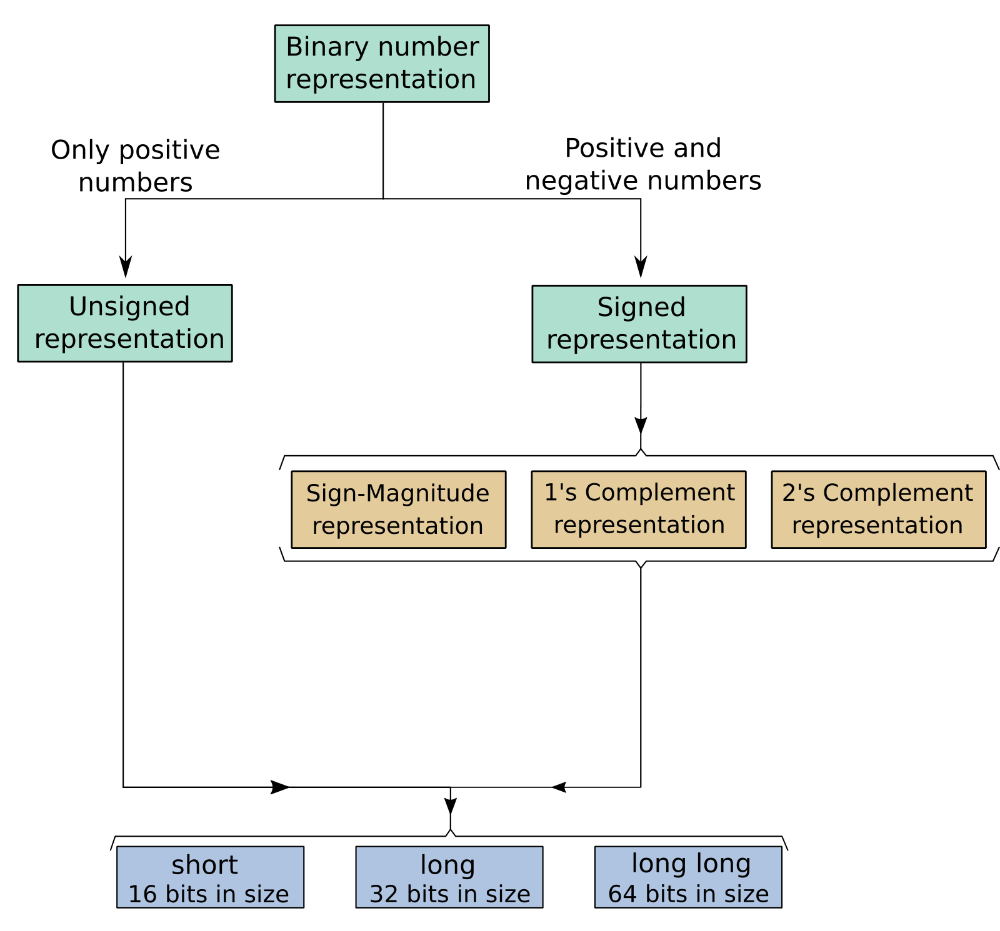

<style>
/* Blog post container */
body {
   font-family: 'Helvetica Neue', Arial, sans-serif;
   font-size: 1rem;
   line-height: 1.8;
   color: #333;
   text-align: justify;
   background-color: #fafafa;
   margin: 0;
   padding: 0 20px;
}

/* Header styling */
h1, 
h2, 
h3, 
h4, 
h5, 
h6 {
  font-weight: 600; /* Semi-bold for a professional look */
  margin-bottom: 0.75em; /* Slightly reduced bottom margin */
  color: #0d0d0d;
  line-height: 1.2;
  margin-top: 1.5em; /* Added top margin for consistency */
}

h1 {
  font-size: 1.75rem; 
  border-bottom: 2px solid #3b80d1;
  padding-bottom: 0.3em; /* Padding for visual separation */
  margin-top: 1em; 
}

h2 {
  font-size: 1.5rem; 
  color: #3b80d1;
  padding-bottom: 0.2em; /* Padding for visual separation */
}

h3 {
  font-size: 1.25rem; 
  color: #333;
}

h4 {
  font-size: 1.125rem; 
  color: #333;
}

h5 {
  font-size: 1rem; 
  color: #333;
}

h6 {
  font-size: 0.875rem; 
  color: #333;
}

/* Link styling */
a {
  color: #3b80d0;
  text-decoration: none;
  transition: color 0.3s ease;
}

a:hover {
  text-decoration: underline;
  color: #1a57a0;
}

/* Code styling */
pre, 
.code-input {
  background-color: #f5f5f5;
  border: 1px solid #ddd;
  padding: 10px;
  font-size: 0.9rem;
  border-radius: 5px;
  margin: 20px 0;
  overflow-x: auto;
}

code {
  font-size: 0.9rem;
  background-color: #f5f5f5;
  padding: 2px 4px;
  border-radius: 3px;
}

/* Table styling */
table {
  width: 100%;
  border-collapse: collapse;
  margin-bottom: 1.5em;
  text-align: left;
}

th, 
td {
  padding: 12px;
  border: 1px solid #ddd;
}

th {
  background-color: #3b80d1;
  color: white;
}

/* Div options - color box text */
.div-1 {
  color: black;
  background-color: #d6edd3;
  padding: 10px;
  border-radius: 5px;
  margin-bottom: 1.5em;
}

.div-2 {
  color: black;
  background-color: #cfbe7e;
  padding: 10px;
  border-radius: 5px;
  margin-bottom: 1.5em;
}

/* Article content */
.article-content {
  text-align: justify;
}

/* Image styling */
img {
  max-width: 100%;
  height: auto;
  border-radius: 5px;
  margin-bottom: 1.5em;
}
</style>

# Introduction

When programming in C, a fundamental step is understanding variable assignment. C offers various data types, and here we focus on `int`, used for integer data. There are two primary methods to define an `int` variable:

<div class="div-1">
* **Uninitialized Variable**: Defined simply as `int x;`, this approach does not assign an initial value to the variable $x$ (Figure 1). It's generally advisable to avoid this since it can lead to bugs if $x$ remains unassigned throughout the code. 
* **Initialized Variable**: Assigning a value to $x$ can be done in two ways (Figure 1):
  <div class = "div-2">
    * Single-step declaration - `int x = 3;`
    * Two-step declaration - First, declare with `int x;` then assign with `x = 3;`
  </div>
</div>

```{r,echo=FALSE,fig.cap="Declaring variables in C", out.width = "550px", fig.align='center'}
knitr::include_graphics('var_and_exp.png')
```

Additionally, C provides various storage sizes for integer variables. We will briefly introduce this concept. Figure 2 illustrates the representation of integers, either as whole numbers or fixed-point numbers (with a fixed number of digits). Typically, computers use a set number of bits to represent these integers. Common bit-lengths for integers include 8-bit, 16-bit (`short`), 32-bit (`long`), or 64-bit (`long long`). There are two main schemes for integer representation: the signed integer type (`signed int`), which can store values ranging from -32,767 to 32,767, and the unsigned integer type (`unsigned int`), which encompasses values from 0 to 65,535 (calculated as $32767 \times 2 + 1$). The `unsigned` qualifier is particularly useful when dealing exclusively with positive values.

```{r,echo=FALSE,fig.cap="Integer Representation", out.width = "500px", fig.align='center'}

```

Furthermore, there are three representation schemes for signed integers: *Sign-Magnitude Representation*, *1's Complement Representation*, and *2's Complement Representation*. These schemes are crucial for representing negative numbers in binary form. In all these schemes, positive signed binary numbers begin with a 0, while negative numbers start with a 1 (Figure 3).

```{r,echo=FALSE,fig.cap="Signed binary numbers", out.width = "300px", fig.align='center'}
knitr::include_graphics('sign_bit.png')
```

A limitation of signed binary numbers is that one bit is dedicated to indicating the sign (positive or negative), leaving the remaining $n-1$ bits for the number's magnitude, ranging from $-2^{n-1}$ to $2^{n-1}$. For instance, in an 8-bit signed binary number, one bit is for the sign, and the remaining seven bits are for the magnitude:

<div class="div-1">
* With Sign-Magnitude Representation:
$$ -|2^{(8-1)}-1| \mbox{ to } 2^{(8-1)}-1 = -127 \mbox{ to } 127 $$
* With 2's Complement Representation:
$$ -2^{(8-1)} \mbox{ to } 2^{(8-1)}-1 = -128 \mbox{ to } 127 $$
</div>

Therefore, using 2's Complement Representation, we can represent numbers from -128 to 127. You might wonder why there's an additional number in the range with 2's Complement. The answer lies in the unique way this representation handles the negative of the lowest negative number, which can be seen in Figure 4.

```{r,echo=FALSE,fig.cap="Representation schemes of Sign-Magnitude Representation and 2's Complement Representation", out.width = "400px", fig.align='center'}
knitr::include_graphics('repre_scheme.png')
```

# Dive Into the World of Integer Representations!

Embark on an exhilarating journey through the binary landscape of computer science! We're set to explore the intricate ways of representing integers, both unsigned and signed, using the power of binary digits. This adventure will take us through two riveting examples, complete with R code snippets for a hands-on experience!

## Unveiling the Unsigned Integers
Picture a sequence of numbers $x$, where $x \in \lbrace 0, 1, \ldots, 15 \rbrace$. We're about to represent these numbers as 4-bit unsigned integers. Imagine this: **4 bits**, each a 0 or 1, combining in myriad ways to encapsulate numbers from 0 to 15. Our journey here explores the interval $[0, 2^{4}−1] \in \mathcal{N}_{0}$.

Here's an R snippet to visualize this transformation:

```{r, echo=FALSE}
library(kableExtra)
bits <- c("0000", "0001", "0010", "0011", "0100", "0101", "0110", "0111", "1000", "1001","1010","1011","1100","1101","1110","1111")
x <- seq(0,15,1)
knitr::kable(t(data.frame(bits,x)), caption="Representation of numbers from 0 to 15 in 4 bits") %>%
  kable_styling(bootstrap_options = c("striped", "hover")) %>%
  column_spec(1, bold = T, border_right = TRUE)
```

Prepare to be amazed as simple integers transform into a beautiful array of zeros and ones!

## Deciphering Signed Integers
Next, let's step into the world of signed integers, representing a sequence $y$ within $\{-7, -6, \ldots, 6, 7\}$. With 4 bits at our disposal, one bit becomes the **sign bit**, while the remaining three are **magnitude bits**. This setup enables us to span $y$ within the range $\left[-|2^3-1|, 2^3-1\right] \in \mathcal{Z}$.

Witness the Sign-Magnitude Representation, where the first bit unveils the sign, and the rest narrate the magnitude:

```{r, echo=FALSE}
library(kableExtra)
bits <- c("0111", "0110", "0101", "0100", "0011", "0010", "0001", "0000", "1000", "1001","1010","1011","1100","1101","1110","1111")
y <- c(seq(7,0,-1), paste("-0"), seq(-1,-7,-1))
knitr::kable(t(data.frame(bits,y)), caption="Sign-Magnitude Representation of numbers from -7 to 7 using 4 bits") %>%
  kable_styling(bootstrap_options = c("striped", "hover")) %>%
  column_spec(1, bold = T, border_right = TRUE)
```

But the intrigue doesn't end there! Introducing the 2's Complement Representation, a brilliant method to elegantly incorporate negative numbers. This approach allows us to explore the depths of the negative spectrum, all the way to -8:

```{r, echo=FALSE}
library(kableExtra)
b1 <- gl(2,2^3, labels = c("0","1"))
b2 <- rep(gl(2,2^2, labels = c("0","1")),2)
b3 <- rep(gl(2,2^1, labels = c("0","1")),4)
b4 <- rep(gl(2,2^0, labels = c("0","1")),8)
bits <- paste0(b1,b2,b3,b4)
y <- c(seq(0,7,1), seq(-8,-1,1))
data <- data.frame(bits,y)
data <- data[order(y),]
rownames(data) <- NULL
knitr::kable(t(data), caption="2's Complement Representation of numbers from -8 to 7 using 4 bits") %>%
  kable_styling(bootstrap_options = c("striped", "hover")) %>%
  column_spec(1, bold = T, border_right = TRUE)
```

These examples, enriched with R code for hands-on experimentation! 🌌💻🚀

# Exploring Further: A New Perspective on Integer Representations

Let's delve deeper into the world of integer representations with a fresh example! We'll take a different approach, offering a new perspective to understand and construct binary representations. This time, we'll focus on a practical application that brings these concepts to life.

## Example: Binary Encoding of Characters

Imagine you want to represent characters (like letters and symbols) in binary. This is essential in computer science, as it allows for the storage and transmission of text in a form that computers can process. We'll use the ASCII (American Standard Code for Information Interchange) system, a widely used method to encode characters.

Each character in ASCII is assigned a unique number, and this number is then represented in binary. For example, the upper-case letter 'A' is represented by the number 65 in ASCII, which corresponds to the binary number 01000001.

Here's an R snippet to visualize this transformation for a set of characters:

```{r, echo=FALSE}
library(kableExtra)
chars <- c('A', 'B', 'C', 'D', 'E', 'F', 'G', 'H', 'I', 'J')
ascii_values <- sapply(chars, charToRaw)
binary_values <- sapply(ascii_values, function(x) paste(rev(as.integer(intToBits(x))), collapse = ""))
knitr::kable(data.frame(Char = chars, ASCII = ascii_values, Binary = binary_values), 
             caption="Binary Encoding of Characters Using ASCII") %>%
  kable_styling(bootstrap_options = c("striped", "hover")) %>%
  column_spec(1, bold = T, border_right = TRUE) %>%
  column_spec(3, monospace = T)
```

This example shows how characters are converted to ASCII values and then to their binary equivalents, demonstrating the practical application of binary representation in everyday computing tasks. Such an understanding is crucial for tasks like data encoding, cryptography, and digital communication.

This fresh perspective, combined with hands-on R code, adds another layer to our understanding of binary representations in the digital world. It's not just about numbers; it's about how even the simplest characters we use every day are translated into a language that computers understand. 🌐🔢🖥️


# Efficiency in Data Storage: Numbers vs. Letters

As we wrap up our exploration of binary representations, it's crucial to understand why storing numbers instead of letters (words) is often more efficient and preferred in terms of memory usage. This principle is key in optimizing data storage and processing in computing systems.

## Why Numbers Trump Letters for Memory Efficiency

### Compact Representation:

- **Fixed Length**: Numbers, especially integers, typically have a fixed-length representation in binary. For example, a 32-bit system will represent all integers using 32 bits, regardless of the value. This uniformity leads to more predictable and efficient memory usage.
- **Greater Density**: A single number can represent a large range of values. For example, a 32-bit integer can represent over 4 billion different values, while 32 bits allocated for characters might only store a few words.

### Processing Speed:

- **Simpler Operations**: Numerical data allows for more straightforward and faster arithmetic operations compared to string processing, which involves character-by-character manipulation.
- **Optimized Hardware**: Computer processors are inherently designed to handle numerical calculations efficiently. Operations on numbers are generally faster due to hardware-level optimizations.

### Memory Management:

- **Less Overhead**: Storing numbers reduces the need for additional memory overhead compared to strings. For instance, numbers do not require extra characters for delimiters or markers that are often needed in text.
- **Indexing and Searching**: It's quicker to index and search through numerical data compared to textual data. This efficiency is crucial in database operations and large-scale data processing.

### Application in Real-World Scenarios:

- **Encoding Complexity**: Complex data like images, videos, and sound are more efficiently stored and processed as numerical values rather than trying to represent them as lengthy strings of text.
- **Data Analysis and Machine Learning**: Numerical data is more amenable to statistical analysis and machine learning algorithms, which rely heavily on numerical inputs for predictions and insights.

In summary, while both numbers and letters have their place in data representation, the choice often boils down to efficiency and suitability for the task at hand. For tasks requiring compact storage, fast processing, and efficient manipulation, numbers usually offer significant advantages over letters or words. This principle of choosing the right data type for the right purpose is fundamental in the field of computer science and data management. 🌍💾🚀

# References

Barnett R.; O'Cull L.; Cox, S. Embedded C Programming and the Microship PIC. Delmar Learning, ed. 1, 2004.

Cadenhead, R.; Liberty, J. Sams Teach Yoirself C++. Pearson Education, ed. 6, 2017.

C Data Types - https://en.wikipedia.org/wiki/C_data_types


# Citation

1. For attribution, please cite this work as:

<div class="div-1">
Oliveira T.P. (2020, Dec. 16). Signed and Unsigned Binary Numbers
</div>

2. BibTeX citation

```
@misc{oliveira2020signed,
  author = {Oliveira, Thiago},
  title = {Signed and Unsigned Binary Numbers},
  url = {https://prof-thiagooliveira.netlify.app/post/signed-and-unsigned-binary-numbers/},
  year = {2020}
}
```

**Did you find this page helpful? Consider sharing it 🙌**
