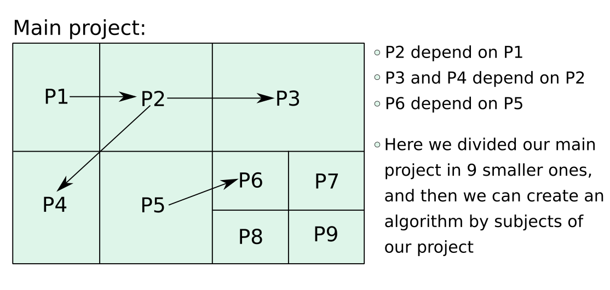
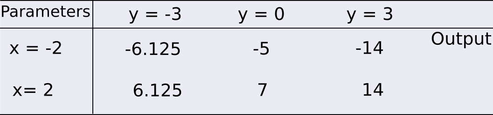

```{r setup, include=FALSE}
knitr::opts_chunk$set(echo = TRUE)
```

# Overview of the Seven Steps

The seven steps proposed by Hilton et al. (2019) is very interesting strategy to start a new project that involves programming process, where a summary of the entire process is shown in the Figure 1. Here we will describe these steps based on thw work of Hilton et al. (2019).

```{r,echo=FALSE,fig.cap="The seven steps (modified from Hilton et al. (2019))"}
knitr::include_graphics('seven_steps.png')
```
All steps are then described in the sections below.

# Step 1 - Project definition using simple examples

This is the moment where you spend time thinking about the project and how could you divide them into small tasks. Start your project drawing a diagram of it by hand, including the main subjects, how you could sorted out the problems, and how many main algorithms should you create to have your project done. Here you may include how the project could be sub-divided in smaller tasks, how this tasks are connected, and if there is an order to execute them (Figure 2). Consequently, this should reflect in the number of main algorithms to be build. Doing a good job during this stage will facilitate the remainder steps.   

```{r,echo=FALSE,fig.cap="Example of how divide the main project into small tasks"}

```

## Example 1

Suppose we would want to write an algorithm in C++ to compute the total fat of a ice cream portion basis ($y$). Suppose also this response variable is a function of butyric fat $x_1$ and vegetable fat $x_2$. Let $E[y]$ be the expected value of $y$ defined as

$$E[y]=10-0.5x_1+0.6x_1^2-0.6x_2+0.2x_2^2+0.1x_1x_2$$
Thus, we can pick particular values for $x_1$, and $x_2$ to calculate the total fat $y$ by hand. If $x_{1}=2$, $x_{2}=1$, then 
$$y=10-0.5\times2+0.6\times 2^2-0.6\times 1+0.2 \times 1^2+0.1\times 2 \times 1 = 11.2.$$

Now, suppose the the second aim is the optimization of reduction in fat ice cream formulation from this fitted model. In this sense, we are looking for the global minimum through the response surface, consequently, we can divide our project into, e. g., two tasks:

<div class="div-2">
1. Generalize the function for any $x_1$ and $x_2$; 
2. Calculate the global (or absolute) minimum point;
</div>

If you get stuck in one of these steps, probably this difficult is comming from a lack of domain knowledge of a particular field, e. g., a lack of domain in mathematics:

<div class="div-2">
* How could I calculate the global minimum? 
* How can I use partial derivatives?
</div>

Thus, during this step you have to identify all lack of domain knowledge and then overcome them before going to the next step. Sometimes, domain knowledge may come from particular fields of computer science, sports, agriculture, statistics, or engineering.


# Step 2 - Write everything you did


In this step you should take notes about what you did to solve the project or tasks within the project. Your notes describing all solutions by task should be precisely enough to anyone else reproduce them easily.  Sometimes we may omit common sense steps such as multiply $x$ by $y$, or the order in which each task should be executed.


## Example 2


Suppose we are interested in computing $f(x,y)=x^y+3x$ when $x=2$ and $y=4$, then we might write down a deatiled descriptions of all steps to compute $f(x,y)$:

<div class="div-2">
* Multiply 2 by 2 $\rightarrow$ you get 4
* Multiply 4 by 2 $\rightarrow$ you get 8
* Multiply 8 by 2 $\rightarrow$ you get 16
* Sum 16 plus 3 multiplied by 2 $\rightarrow$ you get 22
* 22 is the answer.
</div>
The steps are precise as anyone who can perform basic math can follow these steps to get the same answer. 


# Step 3 - Generalize


Our task now is generalize the last steps into an algorithm, finding patterns that allows us to solve the whole class rather than for a particular parameter values. Here is two common way to generalize those steps into algorithm:

<div class="div-2">
* Look all details of your step 2 because, sometimes, you can find the generalization into it description.
* Look for repetition patterns - when the same step repeats several times
</div>

We can, e. g., generalize our **Example 2** just looking the description into step 2, where we can replacing the occurence of 2 by $x$:
<div class="div-2">
* Multiply 2 by $x$ $\rightarrow$ you get 4
* Multiply 4 by $x$ $\rightarrow$ you get 8
* Multiply 8 by $x$ $\rightarrow$ you get 16
* Sum 16 plus 3 multiplied by $x$ $\rightarrow$ you get 22
* 22 is the answer.
</div>
Note that, in the first multiplication, we have to start with $x \times x=2 \times x = 4$, thus the number of times that we should multiply 2 by $x$ are $y-1$. Thus, we would lead to the following generalized steps:

```
Algorithm sketch 1
  
start with x = 2 and y = 4
n[1] = x

Count up from i in 1 to y-1 
  n[i+1] = n[i] * x 

z = n[y] + 3 * x
z is  the answer
```
<div class="div-3">
This process is referred to as writing 'pseudo-code' as an algorithm design with no particular target language.
</div>

# Step 4 - Test Your Algorithm

Testing your algorithm is a useful step to ensure steps 1-3 are actually right before we proceed to the step 5. Some examples about what you should do/think during this stage are described below:

<div class="div-2">
* Test your algorithm choosing different values for parameters
* What happen if the value is positive, negative or equal to zero?
* Have you restricted parameter space? Ex.: $y\geq 0$. 
* Use mathematical proofs
* There is always more than one right answer to a programming problem
</div>

<div class="div-3">
Remember that parameter space is the space of possible parameter values that define a particular mathematical/statistical model, and they are generally a subset of finite-dimensional Euclidean space.
</div>

Sometimes, we mis-generalizing our algorithm at step 3, and this mistake lead us again to the steps 1-2. Generally, mis-generalization happens when we did not consider all possible cases during step 3, or when we did not have mathematical proofs about what we are doing.

A good example of algorithm mistake could be seen in the Example 2. What happens if $y=0$, or $y<0$? We can see that our algorithm handles these cases incorrectly. If you calculate the algorithm steps by hand with $x=2$ and $y=0$ you will get $2^0=2$ rather than $2^0=1$ (correct answer). Additionally, for any value $y\leq 0$ the algorithm try to count from $1$ to $y-1<0$, of which are no Natural number, leading an error in the process. Thus, we can conclude that $|y| \in \mathcal{N}_{0}$, where $\mathcal{N}_{0}=\mathcal{N} \cup \lbrace 0 \rbrace$ represents Natural numbers with zero. In this sense, we might attempt to generalize our algorithm to higher number of cases:

```
Algorithm sketch 2 

y must be a integer number

start with x = 2 and y = 4

if y=0 {
n[1] = 1
i=0
} else{
Count up from i in 1 to |y|-1
  if y<0 {
  n[1] = 1/x
  n[i+1] = n[i] * 1/x 
  } else{
  n[1] = x
  n[i+1] = n[i] * x
  }
}
z = n[i+1] + 3 * x
z is  the answer
```

```{r,echo=FALSE,fig.cap="Example of output using the algorithm 2",fig.align='center'}

```

<div class="div-3">
Question: How can we improve this algorithm? Think about the case where $x=y=0$.
</div>

For some problems, there are particular cases that require our attention. Every time we detect problem with our algorithm in this step, we have to choose one of this option:
<div class="div-2">
1. Return to steps 1-3 to get more information to generalize the algorithm to a higher number of cases. 
2. Skip the last steps and fix the algorithm directly in the step 4 (when we know easily how to fix the problem).
</div>


## Example 3


The numbers in the Figure 4 were obtained from an algorithm that has one parameter $N \in \mathcal{N}_{0}$ to be specified, where $\mathcal{N}_{0}=\mathcal{N} \cup \lbrace 0 \rbrace$ represents Natural numbers with zero, and a sequence of number as output values for each $N$. 

```{r,echo=FALSE,fig.cap="Output of sequences of integers based on values of $N$ from 0 to 4",fig.align='center'}
knitr::include_graphics('example3.png')
```

<div class="div-3">
Question: Determine the algorithm that was used to generate the numbers in this Figure. What is the result for $N=5$?
</div>


# References


[1] Hilton, AD; Lipp, GM; Rodger, SH, Translation from Problem to Code in Seven Steps, Comped 2019 Proceedings of the Acm Conference on Global Computing Education (2019), pp. 78-84. 


# Answers

## Example 3

```
Algorithm sketch 3

N must be a Natural number with zero

start with N = n, where n represents the value 
  Minimum value = 4 * N
  Maximum value = 9 * N + 6
  Increment of the sequence = 3
  
  x[1] = Minimum value
  While x[i] is less than the Maximum value
    x[i] = x[i-1] + Increment of the sequence
  
  x is the answer
```


```{r class.source="code-input"}
# N = 6
N=5
seq <- seq(4*N, 9*N+6, 3)
cat("The answer is", seq)
```


**Did you find this page helpful? Consider sharing it 🙌**