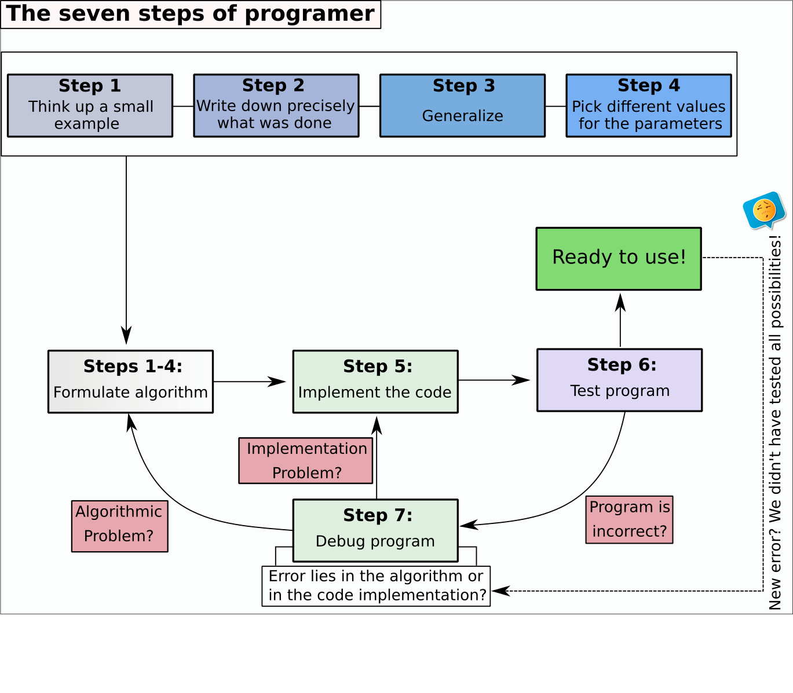

# Overview of the Seven Steps

The seven steps proposed by Hilton et al. (2019) present an intriguing strategy for initiating a new project involving programming. This approach is concisely summarized in Figure 1. In this discussion, we will elaborate on these steps, drawing upon the work of Hilton et al. (2019).

<div class="figure" style="text-align: center">

<p class="caption">The seven steps (modified from Hilton et al. (2019))</p>
</div>

All steps are then described in the sections below.

# Step 1 - Project definition using simple examples

This step involves dedicating time to conceptualize the project and breaking it down into manageable tasks. Begin by manually sketching a diagram of the project, highlighting key topics, strategies for addressing challenges, and estimating the number of primary algorithms required for completion. This should also encompass the subdivision of the project into smaller tasks, their interconnections, and any sequential order for their execution, as depicted in Figure 2. An effective approach in this stage is crucial as it simplifies the subsequent steps. 

<div class="figure" style="text-align: center">

<p class="caption">Example of how divide the main project into small tasks</p>
</div>

## Example 1

Imagine we need to develop a `C++` algorithm to calculate the total fat content ($y$) of a portion of ice cream. Assume this response variable is determined by the amounts of butyric fat ($x_1$) and vegetable fat ($x_2$). Let $E[y]$ represent the expected value of $y$, defined as:

$$E[y]=10-0.5x_1+0.6x_1^2-0.6x_2+0.2x_2^2+0.1x_1x_2$$
We can manually compute the total fat $y$ for specific values of $x_1$ and $x_2$. For instance, if $x_1=2$ and $x_2=1$, then:

$$y=10-0.5\times2+0.6\times 2^2-0.6\times 1+0.2 \times 1^2+0.1\times 2 \times 1 = 11.2.$$

Now, let's assume the secondary goal is to optimize the fat content in the ice cream formulation based on this model. This involves searching for the global minimum on the response surface. Consequently, we can break down our project into two tasks:

<div class="div-2">
1. Generalize the function for any $x_1$ and $x_2$; 
2. Calculate the global (or absolute) minimum point;
</div>

If you encounter difficulties in these tasks, it's often due to a gap in specific domain knowledge, such as a lack of expertise in mathematics:

<div class="div-2">
* How could I calculate the global minimum? 
* How can I use partial derivatives?
</div>

Therefore, during this step, it is essential to identify all the necessary domain knowledge and address these gaps before proceeding to the next stage. Sometimes, this knowledge may stem from specialized areas such as computer science, sports, agriculture, statistics, or engineering.


# Step 2 - Write everything you did


In this phase, it is crucial to meticulously record every action undertaken to resolve the project's challenges or tasks. Ensure that your notes are clear and detailed enough for others to replicate your solutions effortlessly. Be cautious not to overlook steps that might seem obvious, such as basic operations like multiplying $x$ by $y$, or the sequence in which tasks are to be executed.

## Example 2

Consider the task of calculating $f(x, y) = x^y + 3x$ for $x=2$ and $y=4$. Here's how you could document the process in a detailed and comprehensible manner:

<div class="div-2">
* Multiply 2 by 2 $\rightarrow$ you get 4
* Multiply 4 by 2 $\rightarrow$ you get 8
* Multiply 8 by 2 $\rightarrow$ you get 16
* Sum 16 plus 3 multiplied by 2 $\rightarrow$ you get 22
* 22 is the answer.
</div>

By following these explicit steps, anyone with basic mathematical skills should be able to reach the same result.


# Step 3 - Generalize

The goal now is to transform the specific steps from earlier into a universal algorithm that applies to a broader range of cases, not just specific parameter values. Here are two common methods to achieve this generalization:

<div class="div-2">
* Re-examine the details from Step 2, as the key to generalization often lies within its description.
* Identify repetitive patterns, particularly where the same step is executed multiple times.
</div>

For instance, let's generalize our Example 2 by adapting the steps from Step 2, replacing the specific occurrences of 2 with a variable $x$:

<div class="div-2">
* Multiply 2 by $x$ $\rightarrow$ you get 4
* Multiply 4 by $x$ $\rightarrow$ you get 8
* Multiply 8 by $x$ $\rightarrow$ you get 16
* Sum 16 plus 3 multiplied by $x$ $\rightarrow$ you get 22
* 22 is the answer.
</div>

It is important to note that the initial multiplication should start with $x \times x = x^2$. Therefore, we multiply $x$ by itself $y-1$ times to obtain $x^y$. This leads us to the following generalized steps for any values of $x$ and $y$:

```
Algorithm sketch 1
  
start with x = 2 and y = 4
n[1] = x

Count up from i in 1 to y-1 
  n[i+1] = n[i] * x 

z = n[y] + 3 * x
z is  the answer
```
<div class="div-3">
This process is referred to as writing 'pseudo-code' as an algorithm design with no particular target language.
</div>


# Step 4 - Test Your Algorithm

Testing your algorithm is a crucial step to ensure the correctness of steps 1-3 before advancing to step 5. Here are some key actions and considerations during this stage:

<div class="div-2">
* Test your algorithm with varying parameter values.
* Assess the algorithm's behavior for positive, negative, or zero values.
* Determine if you have confined the parameter space, e.g., $y \geq 0$.
* Employ mathematical proofs to validate your approach.
* Recognize that there may be more than one correct solution to a programming problem.
</div>

<div class="div-3">
Remember, the parameter space refers to the range of possible parameter values that define a specific mathematical or statistical model, typically within a subset of the finite-dimensional Euclidean space.
</div>

At times, the generalization in step 3 might be incomplete, leading to a revisit of steps 1-2. This oversight often occurs when not all potential cases are considered or when mathematical proofs are lacking.

A notable example of an algorithmic error is seen in Example 2. What if $y=0$ or $y<0$? Our algorithm incorrectly addresses these cases. For example, with $x=2$ and $y=0$, the algorithm erroneously calculates $2^0=2$ instead of the correct $2^0=1$. Also, for any $y \leq 0$, the algorithm erroneously tries to count from $1$ to $y-1 < 0$, which is not applicable for natural numbers, leading to an error. Therefore, we must ensure $|y| \in \mathcal{N}_{0}$, where $\mathcal{N}_{0}$ represents the set of natural numbers including zero. Consequently, we should aim to generalize our algorithm to accommodate a broader range of cases:

```
Algorithm Sketch 2 

y must be an integer number.

Start with x = 2 and y = 4.

If y=0 {
  n[1] = 1;
  i=0;
} else {
  Count from i = 1 to |y|-1;
  If y < 0 {
    n[1] = 1/x;
    n[i+1] = n[i] * (1/x);
  } else {
    n[1] = x;
    n[i+1] = n[i] * x;
  }
}

z = n[i+1] + 3 * x;
z is the answer.
```

<div class="div-3">
Question: How can we improve this algorithm? Consider the case where $x=y=0$.
</div>

When encountering problems with our algorithm at this stage, we have two options:

<div class="div-2">
1. Return to steps 1-3 to gather more information for broadening the algorithm's applicability.
2. Directly fix the algorithm in step 4 when the solution is known.
</div>

## Example 3

The data in Figure 4 originates from an algorithm that accepts a single parameter, $N$, belonging to the set $\mathcal{N}_{0}$, where $\mathcal{N}_{0} = \mathcal{N} \cup \{ 0 \}$ denotes the set of natural numbers including zero. This algorithm generates a sequence of output values corresponding to each specified value of $N$.

<div class="figure" style="text-align: center">

<p class="caption">Output of sequences of integers based on values of $N$ from 0 to 4</p>
</div>

<div class="div-3">
Question: Can you deduce the algorithm that produced the numbers in this figure? Additionally, what would be the result for $N=5$?
</div>


# References


[1] Hilton, AD; Lipp, GM; Rodger, SH, Translation from Problem to Code in Seven Steps, Comped 2019 Proceedings of the Acm Conference on Global Computing Education (2019), pp. 78-84. 


# Answers

## Example 3

```
Algorithm Sketch 3

Set N as a non-negative integer (Natural number with zero).

Initialize N with a specific value n.

  Define the sequence parameters:
    Minimum Value = 4 * N
    Maximum Value = 9 * N + 6
    Sequence Increment = 3

  Set x[1] to the Minimum Value.
  
  Iteratively calculate the sequence:
    For each iteration i,
      if x[i-1] < Maximum Value,
        then x[i] = x[i-1] + Sequence Increment.
      else,
        break the loop.

  The sequence x represents the final answer.
```


```{.r .code-input}
# N = 6
N=5
seq <- seq(4*N, 9*N+6, 3)
cat("The answer is", seq)
```

```
## The answer is 20 23 26 29 32 35 38 41 44 47 50
```


# Citation

1. For attribution, please cite this work as:

<div class="div-1">
Oliveira T.P. (2020, Dec. 16). The seven steps of a programer
</div>

2. BibTeX citation

```
@misc{oliveira2020seven,
  author = {Oliveira, Thiago},
  title = {The seven steps of a programer},
  url = {https://prof-thiagooliveira.netlify.app/post/the-seven-steps-of-a-programer/},
  year = {2020}
}
```

**Did you find this page helpful? Consider sharing it 🙌**

<style>
/* ====== Post-only layout + typography polish (Hugo Blox / Tailwind) ====== */
/* Place this at the very end of the post so it wins the cascade. */

/* 0) Widen the page shell Hugo Blox uses around articles */
.page-body > .mx-auto,
.page-body .max-w-screen-xl{
  max-width: 100vw !important;
  width: 100% !important;
  padding-left: 0 !important;
  padding-right: 0 !important;
}

/* 1) Remove the Tailwind max-w cap on the <main> inside <article> */
.page-body article > main{
  max-width: none !important;  /* beats .max-w-6xl */
  width: 100% !important;
}

/* 2) Control the actual reading width (fluid per breakpoint) */
.page-body article .prose{
  /* Base: a touch larger with comfy line height */
  font-size: clamp(1rem, 0.96rem + 0.25vw, 1.12rem);
  line-height: 1.75;
  text-align: left;
  margin-inline: auto;

  /* Reading width: scale up on big screens, but keep lines readable */
  max-width: 86ch !important; /* default desktop */
}
@media (min-width: 1024px){  /* lg */
  .page-body article .prose{ max-width: 96ch !important; }
}
@media (min-width: 1280px){  /* xl */
  .page-body article .prose{ max-width: 102ch !important; }
}
@media (min-width: 1536px){  /* 2xl / very wide */
  .page-body article .prose{ max-width: 108ch !important; }
}

/* 3) Phones/tablets: full width with side padding */
@media (max-width: 768px){
  .page-body article .prose{
    max-width: 100% !important;
    padding-inline: 1rem;
  }
}

/* 4) Give the article more room by slimming sidebars on wide screens */
@media (min-width: 1280px){
  .hb-sidebar-container, .hb-toc { width: 12rem !important; } /* was 16rem */
}
@media (max-width: 1279.98px){
  .hb-sidebar-container{ display:none !important; } /* hide sidebar under xl */
}

/* --------- Clean, professional type polish (scoped to post content) -------- */
.page-body article .prose p{
  margin: 0 0 1.15em;
  text-wrap: pretty;
  hyphens: auto;
}

.page-body article .prose h1{
  font-size: clamp(1.9rem, 1.6rem + 1.2vw, 2.3rem);
  margin: 1.2em 0 .5em;
  padding-bottom: .25em;
  border-bottom: 2px solid #e5e7eb;
}
.page-body article .prose h2{
  font-size: clamp(1.4rem, 1.2rem + 0.6vw, 1.7rem);
  margin: 1.35em 0 .4em;
  padding-bottom: .2em;
  border-bottom: 1px solid #e5e7eb;
}
.page-body article .prose h3{
  font-size: clamp(1.15rem, 1.05rem + 0.35vw, 1.35rem);
  margin: 1.1em 0 .3em;
}

/* Links: subtle underline-on-hover */
.page-body article .prose a{
  color: #2f6ab5;
  text-decoration: none;
  border-bottom: 1px solid rgba(47,106,181,.25);
}
.page-body article .prose a:hover{
  color: #1f4f8f;
  border-bottom-color: currentColor;
}

/* Code blocks & inline code */
.page-body article .prose pre{
  background: #f6f8fa;
  border: 1px solid #e5e7eb;
  border-radius: 8px;
  padding: 12px 14px;
  overflow: auto;
}
.page-body article .prose code{
  background: #f6f8fa;
  border: 1px solid #e5e7eb;
  border-radius: 5px;
  padding: .15em .35em;
  font-size: .95em;
}
.page-body article .prose pre code{
  background: none; border: 0; padding: 0; font-size: 0.95em;
}

/* Tables */
.page-body article .prose table{
  width: 100%;
  border-collapse: collapse;
  margin: 1.2rem 0;
  font-variant-numeric: tabular-nums;
}
.page-body article .prose th,
.page-body article .prose td{
  border: 1px solid #e5e7eb;
  padding: .6rem .75rem;
}
.page-body article .prose thead th{
  background: #2f6ab5;
  color: #fff;
  text-align: left;
}

/* Images & figures */
.page-body article .prose img{ border-radius: 6px; }

/* Optional: allow “full-bleed” wide elements
   Add class="wide" to a block (table/pre/img wrapper) to span the viewport. */
.page-body article .prose .wide{
  width: 100vw;
  position: relative;
  left: 50%;
  right: 50%;
  margin-left: -50vw;
  margin-right: -50vw;
  padding-inline: clamp(12px, 4vw, 36px);
}

/* Footer timestamp spacing */
.page-body article time{ margin-top: 2rem; display: block; }

/* Dark mode tweaks */
html.dark .page-body article .prose pre,
html.dark .page-body article .prose code{
  background: #111826;
  border-color: #253041;
}
html.dark .page-body article .prose thead th{ background: #5aa0ff; }
</style>
