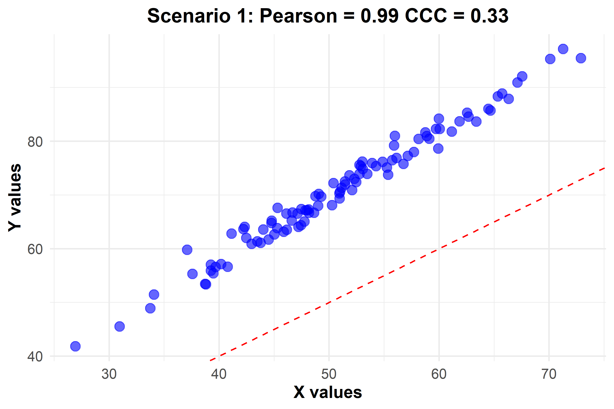
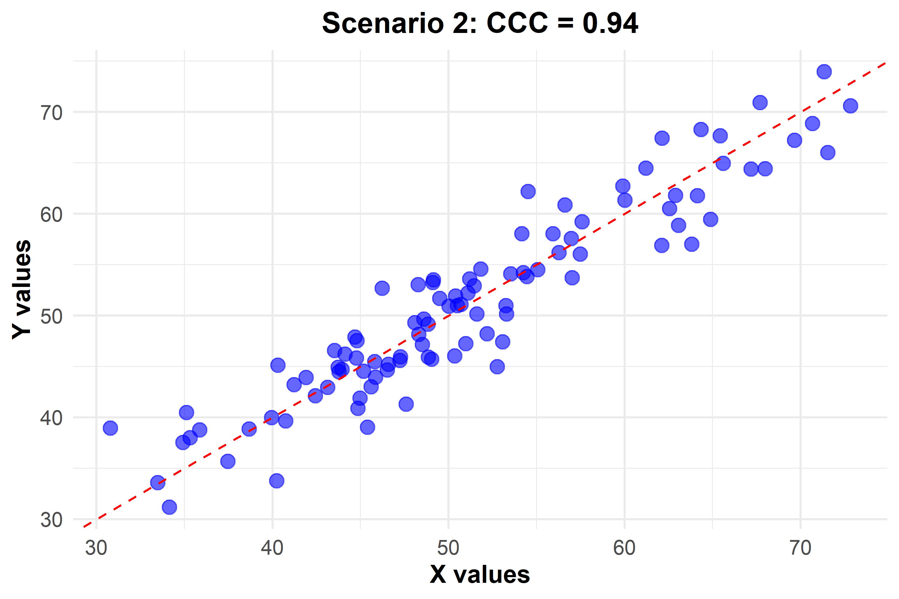
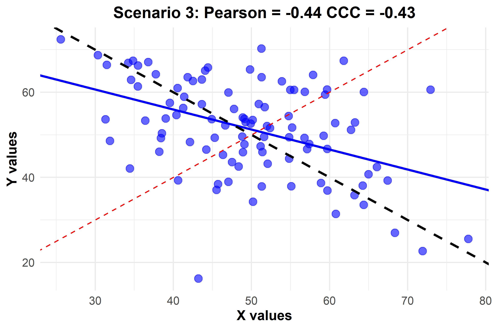

<style>
/* Blog post container */
body {
   font-family: 'Helvetica Neue', Arial, sans-serif;
   font-size: 1rem;
   line-height: 1.8;
   color: #333;
   text-align: justify;
   background-color: #fafafa;
   margin: 0;
   padding: 0 20px;
}

/* Header styling */
h1, 
h2, 
h3, 
h4, 
h5, 
h6 {
  font-weight: 600; /* Semi-bold for a professional look */
  margin-bottom: 0.75em; /* Slightly reduced bottom margin */
  color: #0d0d0d;
  line-height: 1.2;
  margin-top: 1.5em; /* Added top margin for consistency */
}

h1 {
  font-size: 1.75rem; 
  border-bottom: 2px solid #3b80d1;
  padding-bottom: 0.3em; /* Padding for visual separation */
  margin-top: 1em; 
}

h2 {
  font-size: 1.5rem; 
  color: #3b80d1;
  padding-bottom: 0.2em; /* Padding for visual separation */
}

h3 {
  font-size: 1.25rem; 
  color: #333;
}

h4 {
  font-size: 1.125rem; 
  color: #333;
}

h5 {
  font-size: 1rem; 
  color: #333;
}

h6 {
  font-size: 0.875rem; 
  color: #333;
}

/* Link styling */
a {
  color: #3b80d0;
  text-decoration: none;
  transition: color 0.3s ease;
}

a:hover {
  text-decoration: underline;
  color: #1a57a0;
}

/* Code styling */
pre, 
.code-input {
  background-color: #f5f5f5;
  border: 1px solid #ddd;
  padding: 10px;
  font-size: 0.9rem;
  border-radius: 5px;
  margin: 20px 0;
  overflow-x: auto;
}

code {
  font-size: 0.9rem;
  background-color: #f5f5f5;
  padding: 2px 4px;
  border-radius: 3px;
}

/* Table styling */
table {
  width: 100%;
  border-collapse: collapse;
  margin-bottom: 1.5em;
  text-align: left;
}

th, 
td {
  padding: 12px;
  border: 1px solid #ddd;
}

th {
  background-color: #3b80d1;
  color: white;
}

/* Div options - color box text */
.div-1 {
  color: black;
  background-color: #d6edd3;
  padding: 10px;
  border-radius: 5px;
  margin-bottom: 1.5em;
}

.div-2 {
  color: black;
  background-color: #cfbe7e;
  padding: 10px;
  border-radius: 5px;
  margin-bottom: 1.5em;
}

/* Article content */
.article-content {
  text-align: justify;
}

/* Image styling */
img {
  max-width: 100%;
  height: auto;
  border-radius: 5px;
  margin-bottom: 1.5em;
}
</style>

# General idea

The Concordance Correlation Coefficient (CCC) is a statistical measure designed to evaluate the agreement between two sets of measurements, such as those represented by two random variables, $X$ and $Y$. Mathematically, the CCC is defined as:

$$\rho_c = \frac{2\sigma_{x,y}}{\sigma_x^2 + \sigma_y^2 + (\mu_x - \mu_y)^2} = \frac{2\rho\sigma_x\sigma_y}{\sigma_x^2 + \sigma_y^2 + (\mu_x - \mu_y)^2} = \rho \times C_b.$$

In this formula, $\sigma_x$ and $\sigma_y$ are the standard deviations of $X$ and $Y$, respectively, showing the variability within each set of measurements. The means, $\mu_x$ and $\mu_y$, represent the central tendency of each dataset. The term $\rho$ is Pearson's correlation coefficient, expressing the linear association between $X$ and $Y$, while $C_b$, the bias correction factor, quantifies the deviation of the best-fit line from the 45-degree line through the origin---the line of perfect agreement. 

Understanding the concepts of precision and accuracy is crucial for grasping the essence of CCC (Concordance Correlation Coefficient). Let's break down these components:

1.  **Precision**: This aspect refers to the consistency or repeatability of measurements (Figure 1). Imagine a target with a bullseye:

    - If you shoot a series of arrows, and they all land very close to each other but not necessarily near the bullseye, this demonstrates high precision. The arrows are consistently hitting the same spot, showing that your measurements (in this case, arrow shots) are repeatable and reliable. 

    - However, high precision does not guarantee that you are hitting the target accurately. Your consistent shots might be clustered in a corner of the target, far from the bullseye.

2.  **Accuracy**: This term refers to how close the measurements are to the 'true' or accepted value (Figure 1). Continuing with the target analogy:

    - If your arrows hit or are very close to the bullseye, this indicates high accuracy. You are hitting the correct or intended spot.

    - It's possible to be accurate without being precise if your arrows are scattered all around the bullseye, each hitting close but not in a consistent pattern.

```{r,echo=FALSE,fig.cap="Example of precision and accuracy concept. The red dot in the center represents the bullseye.", out.width = "500px", fig.align='center'}
knitr::include_graphics('dartboard_precision_accuracy.gif')
```

Now, applying these concepts to CCC. The **CCC measures both the precision and accuracy of a set of measurements**. It assesses the strength of the relationship between two variables (precision) and how closely these measurements agree with the 'true' or accepted values (accuracy). A high CCC indicates that not only are the measurements consistent with each other (precision), but they also closely match the true values (accuracy). In our analogy, this would be like consistently hitting the bullseye with every arrow.

Furthermore, in the context of CCC, the concept of a "true" value is central. One variable is considered the standard or "true" measurement against which the other is compared. This distinction is vital because CCC is not merely a correlation but a measure of agreement. The notion of a "true" value in scientific research is intricate, often defined by theoretical constructs or consensus standards, and the assumption of truth can be challenged or refined with advancing knowledge and technology. Thus, CCC offers a way to quantitatively assess how well our measurements reflect what we accept as true, acknowledging that our understanding of "true" can evolve.

To illustrate, in Scenario 1, even with a Pearson correlation near 1, the CCC's modest value signals a discrepancy from the true value, reflecting either a systematic bias or scale differences between the measurements. The dashed red line represents the line of perfect agreement, where the true values would ideally lie. This scenario underscores the necessity of considering both precision and accuracy---where precision alone can mislead, and accuracy is pivotal for measurements to be meaningful and trustworthy.

```{r,echo=FALSE,fig.cap="Scenario 1 - High Pearson correlation with modest CCC indicating possible systematic bias or scale differences. The dashed line represents perfect agreement", out.width = "500px", fig.align='center'}

```

Scenario 2 presents a contrasting picture with a CCC value of 0.95, indicating not only a strong linear relationship but also a high degree of concordance. In this instance, the measurements not only follow a consistent pattern (precision) but also align closely with the line of perfect agreement (accuracy), suggesting that one set of measurements can be reliably used as a surrogate for the true values.

```{r,echo=FALSE,fig.cap="Scenario 2 - Strong linear relationship and high concordance with CCC at 0.95. The dashed line indicates the line of perfect agreement", out.width = "500px", fig.align='center'}

```

In Scenario 3, we explore a scenario characterized by a negative Pearson correlation coefficient of approximately -0.44 and a Concordance Correlation Coefficient (CCC) of -0.43. This specific case demands a tailored approach to understanding concordance within inverse relationships. Instead of using the $Y = X$ line commonly associated with positive correlations, we introduce a new reference line represented by $Y = 100 - X$ (depicted as the black dashed line in the plot). This reference line possesses a slope of -1 and serves as the benchmark for perfect inverse agreement.

```{r,echo=FALSE,fig.cap="Scenario 3: Inverse relationship with both Pearson correlation and CCC around -0.44. The red dashed line represents $Y = X$, the black dashed line is the $Y = 100 - X$, and the blue solid line is the best fit line", out.width = "500px", fig.align='center'}

```

The noteworthy aspect of this scenario lies in the high $C_b$ value, which is approximately 0.98 ($C_b = \frac{\rho_c}{\rho} = \frac{-0.43}{-0.44}$). This value is calculated as the ratio of CCC to the Pearson correlation coefficient. While the negative Pearson correlation may not indicate a high precision, the elevated $C_b$ value implies that $Y$ and $X$ are almost perfectly accurate.

Now, let's take a closer look at an intriguing scenario. If we push the Pearson correlation to the extreme, reaching -1, we witness a perfect inverse agreement. In this scenario, every data point converges precisely onto the black dashed line, forming an impeccable alignment. Notably, even the best fit line mirrors this black dashed line in perfect harmony, showcasing the unparalleled concordance in this exceptional case.

```{r,echo=FALSE,fig.cap="Scenario 4: Inverse relationship with both Pearson correlation varying from -0.43 to -1. The red dashed line represents $Y = X$, the black dashed line is the $Y = 100 - X$, and the blue solid line is the best fit line", out.width = "600px", fig.align='center'}
knitr::include_graphics('scenario4_gif.gif')
```

In Scenario 5, the CCC value of 0 denotes absolute non-concordance, indicating that the variability between the measurements does not correspond to the variability expected by chance alone. This suggests that the measurements lack any systematic agreement and cannot be used interchangeably or as reliable estimates of one another. The complete absence of concordance highlights the importance of accuracy in measurement, underscoring that precision without accuracy does not yield valid or useful data in reflecting the assumed "true" values.

```{r,echo=FALSE,fig.cap="Scenario 5 - No agreement with CCC at 0", out.width = "500px", fig.align='center'}

```

These scenarios vividly demonstrate the nuanced interplay between precision and accuracy within the framework of CCC. They bring to light the importance of accuracy in scientific measurement and the limitations of relying solely on correlation coefficients for assessing the validity and reliability of data.

To further strengthen the discussion, we must consider the assumptions and limitations of CCC. It assumes that the data scales are continuous and that the relationship between the measures is linear. The presence of outliers can unduly influence the CCC, and it may not be suitable for all data types. Additionally, the CCC does not account for random error, which can affect measurements variably.

When considering alternative measures, such as Bland-Altman plots, we can address scenarios where CCC is less suitable, like non-normal data or comparisons of more than two measurement sets.

In practical terms, CCC can be used to validate new measurement methods against established gold standards, underscoring its application in method comparison studies. Real-world examples where CCC has been pivotal could include its use in clinical settings for comparing measurement techniques, methods of colour measurements in agriculture, and model diagnostic in statistics.

For computational purposes, the statistical environment `R` has functions and libraries dedicated to calculating CCC, making it accessible for researchers and practitioners to apply this measure to their data. The `epiR` package in `R`, for instance, provides a function `epi.ccc` specifically for calculating Lin's CCC.

If one prefers to write a custom function in `R` for educational or analytical purposes, the following function can be used to compute a point estimate for Lin's Concordance Correlation Coefficient (CCC):

``` r
#' Calculate Lin's Concordance Correlation Coefficient (CCC)
#'
#' This function computes Lin's Concordance Correlation Coefficient to evaluate the agreement
#' between two sets of measurements. It returns the CCC which combines measures of precision
#' and accuracy to determine how well the data from the two sets conform to the line of
#' perfect concordance.
#'
#' @param x A numeric vector of measurements.
#' @param y A numeric vector of measurements, where each element corresponds to the element in `x`.
#'
#' @return The Concordance Correlation Coefficient as a numeric value.
#'
#' @examples
#' x <- c(1, 2, 3, 4, 5)
#' y <- c(1.1, 1.9, 3.1, 4.2, 4.8)
#' ccc(x, y)
#'
#' @export
ccc <- function(x, y) {
  # Check if inputs are numeric vectors
  stopifnot(is.numeric(x), is.numeric(y))

  # Calculate Pearson's correlation coefficient
  rho <- cor(x, y)

  # Calculate means of x and y
  mean_x <- mean(x)
  mean_y <- mean(y)

  # Calculate variances of x and y
  var_x <- var(x)
  var_y <- var(y)

  # Calculate CCC based on the formula
  ccc_value <- (2 * rho * sqrt(var_x) * sqrt(var_y)) / 
               (var_x + var_y + (mean_x - mean_y)^2)

  return(ccc_value)
}
```

This function begins by calculating Pearson's correlation coefficient ($rho$) for the input vectors $x$ and $y$. It then computes the means ($mean_x$ and $mean_y$) and variances ($var_x$ and $var_y$) of the two sets of measurements. The CCC is calculated by combining these values according to the formula, thereby quantifying the agreement between the two measurements in terms of both precision and accuracy.

Using the custom `ccc` function provides a straightforward computation of Lin's Concordance Correlation Coefficient (CCC) for research applications, particularly when a simple estimate of concordance is required. However, for a more comprehensive analysis, the `epi.ccc` function from the <a href="https://cran.r-project.org/web/packages/epiR/index.html">`epiR` package</a> is advantageous as it not only computes CCC but also provides confidence intervals for the CCC value, offering a statistical range within which the true concordance lies with a certain probability. This is crucial for making inferences about the precision of the agreement between measurements in research.

For those looking to apply CCC specifically to Lin's method, both the <a href="https://cran.r-project.org/web/packages/epiR/index.html">`epiR` package</a> and the <a href="https://cran.r-project.org/web/packages/DescTools/index.html">`DescTools` package</a> on CRAN offer robust tools. The `DescTools` package provides a comprehensive collection of statistical functions, including methods for calculating CCC.

For studies involving repeated measures, where the same subjects are measured under different conditions or at different times, the <a href="https://cloud.r-project.org/web/packages/lcc/index.html">`lcc` package</a> offers functions for calculating CCC for longitudinal data, taking into account the within-subject correlation.

Additionally, the <a href="https://cran.r-project.org/web/packages/cccrm/index.html">`cccrm` package</a> provides functions for calculating the CCC for repeated (and non-repeated) measures, catering to a wide range of research designs and ensuring that the variability inherent in repeated measures is appropriately accounted for.

These packages are valuable additions to the toolkit of researchers, statisticians, and data analysts, enhancing the reliability and interpretability of concordance assessments in scientific studies.

# R code used to produce the data and plots

```         
# Load necessary libraries
library(MASS)
library(ggplot2)

# Function to calculate Concordance Correlation Coefficient (CCC)
ccc <- function(x, y) {
  # Check if inputs are numeric vectors
  stopifnot(is.numeric(x), is.numeric(y))

  # Calculate Pearson's correlation coefficient
  rho <- cor(x, y)

  # Calculate means of x and y
  mean_x <- mean(x)
  mean_y <- mean(y)

  # Calculate variances of x and y
  var_x <- var(x)
  var_y <- var(y)

  # Calculate CCC based on the formula
  ccc_value <- (2 * rho * sqrt(var_x) * sqrt(var_y)) / 
               (var_x + var_y + (mean_x - mean_y)^2)

  return(ccc_value)
}

# Set seed for reproducibility
set.seed(123)

# Function to generate and plot data for each scenario
data_plot <- function(mean, cov, scenario_number) {
  data <- mvrnorm(100, mu = mean, Sigma = cov)
  df <- data.frame(x = data[,1], y = data[,2])
  
  title <- ifelse(scenario_number == 3 || scenario_number == 4,
                  paste("Scenario", scenario_number, ": Pearson =", round(cor(df$x, df$y), 2), 
                        "CCC =", round(ccc(df$x, df$y), 2)),
                  paste("Scenario", scenario_number, ": CCC =", round(ccc(df$x, df$y), 2)))
  
  p <- ggplot(df, aes(x = x, y = y)) + 
    geom_point(color = "blue", alpha = 0.6, size = 3) +
    ggtitle(title) +
    xlab("X values") +
    ylab("Y values") +
    theme_minimal() +
    theme(plot.title = element_text(hjust = 0.5, face = "bold", size = 14),
          axis.title.x = element_text(face = "bold", size = 12),
          axis.title.y = element_text(face = "bold", size = 12),
          axis.text.x = element_text(size = 10),
          axis.text.y = element_text(size = 10))
  
  if (scenario_number == 3 || scenario_number == 4) {
    p <- p + geom_smooth(method = "lm", color = "blue", se = FALSE) +
      geom_abline(slope = -1, intercept = 100, linetype = "dashed", color = "black") +
      geom_abline(slope = 1, intercept = 0, linetype = "dashed", color = "red")
  } else {
    p <- p + geom_abline(slope = 1, intercept = 0, linetype = "dashed", color = "red")
  }
  
  print(p)
}

# Scenario 1: High Pearson correlation, modest CCC
data_plot(c(50, 70), matrix(c(100, 0.99 * sqrt(100) * sqrt(150), 0.99 * sqrt(100) * sqrt(150), 150), 2), 1)

# Scenario 2: High CCC
data_plot(c(50, 50), matrix(c(100, 0.95 * sqrt(100) * sqrt(100), 0.95 * sqrt(100) * sqrt(100), 100), 2), 2)

# Scenario 3: Negative Pearson and CCC
data_plot(c(50, 50), matrix(c(100, -0.3 * sqrt(100) * sqrt(150), -0.3 * sqrt(100) * sqrt(150), 150), 2), 3)

# Scenario 4 (previously 5): Perfect inverse agreement
data_plot(c(50, 50), matrix(c(100, -1 * sqrt(100) * sqrt(100), -1 * sqrt(100) * sqrt(100), 100), 2), 4)

# Scenario 5 (previously 4): No correlation (CCC = 0)
data_plot(c(50, 50), matrix(c(100, 0, 0, 150), 2), 5)
```

# References

Carrasco, J. L., King, T. S., & Chinchilli, V. M. (2009). The Concordance Correlation Coefficient for Repeated Measures Estimated by Variance Components. *Journal of Biopharmaceutical Statistics, 19*, 90-105. DOI: 10.1080/10543400802527890

Oliveira, T. de P., Hinde, J., & Zocchi, S. S. (2018). Longitudinal Concordance Correlation Function Based on Variance Components: An Application in Fruit Color Analysis. *Journal of Agricultural, Biological, and Environmental Statistics, 23*(2), 233-254. DOI: 10.1007/s13253-018-0321-1

Rathnayake, L. N., & Choudhary, P. K. (2017). Semiparametric Modeling and Analysis of Longitudinal Method Comparison Data. *Statistics in Medicine, 36*, 2003-2015. DOI: 10.1002/sim.7261

# Citation

1.  For attribution, please cite this work as:

<div class="div-1">
Oliveira T.P. (2024, Jan. 10). Precision & Accuracy - The Role of Concordance Correlation in Research
</div>

2.  BibTeX citation

```         
@misc{oliveira2024concordance,
  author = {Oliveira, Thiago},
  title = {Precision & Accuracy - The Role of Concordance Correlation in Research},
  url = {https://prof-thiagooliveira.netlify.app/post/precision-and-accuracy-the-role-of-concordance-correlation-in-research/},
  year = {2024}
}
```

**Did you find this page helpful? Consider sharing it 🙌**
