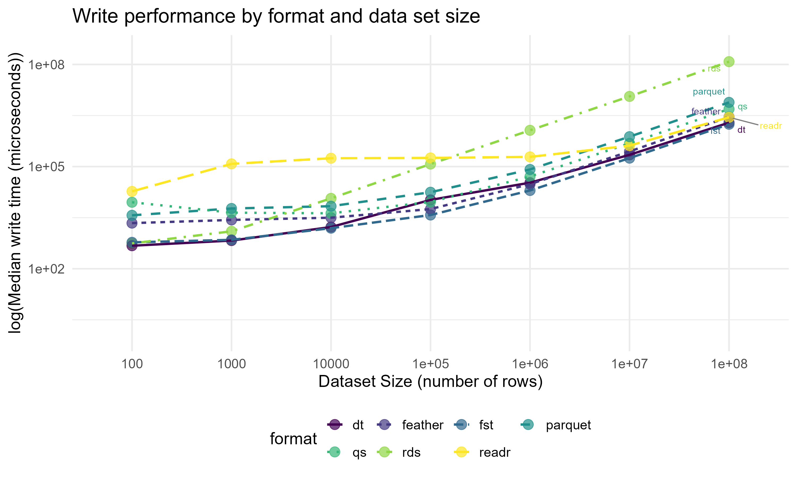

<style>
/* Blog post container */
body {
   font-family: 'Helvetica Neue', Arial, sans-serif;
   font-size: 1rem;
   line-height: 1.8;
   color: #333;
   text-align: justify;
   background-color: #fafafa;
   margin: 0;
   padding: 0 20px;
}

/* Header styling */
h1, 
h2, 
h3, 
h4, 
h5, 
h6 {
  font-weight: 600; /* Semi-bold for a professional look */
  margin-bottom: 0.75em; /* Slightly reduced bottom margin */
  color: #0d0d0d;
  line-height: 1.2;
  margin-top: 1.5em; /* Added top margin for consistency */
}

h1 {
  font-size: 1.75rem; 
  border-bottom: 2px solid #3b80d1;
  padding-bottom: 0.3em; /* Padding for visual separation */
  margin-top: 1em; 
}

h2 {
  font-size: 1.5rem; 
  color: #3b80d1;
  padding-bottom: 0.2em; /* Padding for visual separation */
}

h3 {
  font-size: 1.25rem; 
  color: #333;
}

h4 {
  font-size: 1.125rem; 
  color: #333;
}

h5 {
  font-size: 1rem; 
  color: #333;
}

h6 {
  font-size: 0.875rem; 
  color: #333;
}

/* Link styling */
a {
  color: #3b80d0;
  text-decoration: none;
  transition: color 0.3s ease;
}

a:hover {
  text-decoration: underline;
  color: #1a57a0;
}

/* Code styling */
pre, 
.code-input {
  background-color: #f5f5f5;
  border: 1px solid #ddd;
  padding: 10px;
  font-size: 0.9rem;
  border-radius: 5px;
  margin: 20px 0;
  overflow-x: auto;
}

code {
  font-size: 0.9rem;
  background-color: #f5f5f5;
  padding: 2px 4px;
  border-radius: 3px;
}

/* Table styling */
table {
  width: 100%;
  border-collapse: collapse;
  margin-bottom: 1.5em;
  text-align: left;
}

th, 
td {
  padding: 12px;
  border: 1px solid #ddd;
}

th {
  background-color: #3b80d1;
  color: white;
}

/* Div options - color box text */
.div-1 {
  color: black;
  background-color: #d6edd3;
  padding: 10px;
  border-radius: 5px;
  margin-bottom: 1.5em;
}

.div-2 {
  color: black;
  background-color: #cfbe7e;
  padding: 10px;
  border-radius: 5px;
  margin-bottom: 1.5em;
}

/* Article content */
.article-content {
  text-align: justify;
}

/* Image styling */
img {
  width: 100%;
  height: auto;
  border-radius: 5px;
  margin-bottom: 1.5em;
  cursor: pointer;
  transition: transform 0.5s;
}
</style>

<script>
  function openImageInNewWindow(imgSrc) {
    const newWindow = window.open();
    newWindow.document.write(``);
    newWindow.document.close();
  }
</script>

# Post Summary

Efficient data handling is crucial for daily data analysis tasks. In this post, we will compare the performance of various data formats in `R` for reading and writing operations. The formats considered include RDS, CSV (using `data.table` and `readr`), FST, Feather, Parquet, and QS. We will benchmark the speed, file sizes, and memory usage of each format across different data sizes.

# Database Definition

In this section, we will describe each of the data formats in detail, highlighting their strengths and weaknesses. We will provide insights into the specific use cases where each format excels. The choice of format will depend on the specific needs of the data analysis tasks.

## RDS

RDS is a format native to `R` that is highly efficient for saving single R objects. The `saveRDS()` and `readRDS()` functions are used to write and read `R` objects, respectively. RDS seamlessly integrates with `R`, retaining object metadata including data types and structures, which is beneficial for preserving the exact state of an `R` object. It provides fast read and write operations for moderate data sizes, making it suitable for storing intermediate results and final outputs in `R`. Additionally, it is easy to use with built-in `R` functions. However, it can result in larger file sizes compared to some compressed formats due to lack of advanced compression. Moreover, RDS has limited compatibility with other software or programming languages, limiting its use for data sharing outside of `R` environments.

## QS

QS (Quick Serialization of `R` objects) is a binary format for `R` objects that emphasizes speed and compression. It uses advanced compression algorithms to achieve high performance. QS provides extremely fast read and write operations, even for large data sets, making it suitable for high-performance computing tasks. It uses advanced compression techniques to reduce file size significantly without compromising on speed. Additionally, QS preserves `R` object metadata, ensuring that data types and structures are maintained. However, QS is mainly designed for use within `R`, with limited support in other programming environments. It also requires familiarity with additional functions and parameters to fully leverage its capabilities, which might be a barrier for new users. The goal of this package is to provide a lightning-fast and complete replacement for the `saveRDS` and `readRDS` functions in `R`.

## CSV (using `data.table` and `readr`)

CSV (Comma-Separated Values) is a plain text format widely used for data storage and transfer. `R` offers multiple ways to handle CSV files, with `data.table` and `readr` being popular for their speed and efficiency. The universality of CSV makes it readable across different software and programming languages. Its simple, plain text format can be easily inspected and edited manually, facilitating easy debugging and quick checks. Moreover, `data.table` and `readr` provide efficient functions for reading and writing CSV files in `R`, enhancing performance over base `R` functions. However, CSV does not retain data types and structure information, requiring manual handling and potential data type issues when reading back. It is generally slower for large data sets compared to binary formats due to the need to parse text. The text format also results in larger file sizes, especially for large data sets with many rows and columns.

## Columnar storage formats

Columnar storage is a method of storing data tables that improves the efficiency of reading and writing operations, especially for large data sets. Instead of storing data row by row, columnar storage organizes data by columns. This allows for more efficient data compression and faster retrieval of specific columns, which is particularly beneficial for analytical queries that often access a subset of columns from a large data set.

### FST

The `fst` package is a fast, binary data format for `R` data frames. It uses a highly efficient columnar storage format and supports multiple compression algorithms. FST offers extremely fast read and write operations, especially for large data sets, making it ideal for scenarios requiring frequent data access and manipulation. It efficiently compresses data, reducing file size significantly without sacrificing speed. The columnar storage format is optimized for columnar data access, enhancing speed for specific column retrieval and partial data loading. While FST is primarily designed for use within `R`, it is not limited to it. The `pyfst` library, for example, provides an interface to the `OpenFst` library, enabling similar fast storage and retrieval functionalities in Python. However, within `R`, FST can be slightly more complex to use compared to native formats due to additional options and parameters for compression and storage.

### Feather

Feather is a binary columnar data format that is part of the Apache Arrow project. It provides efficient storage for data frames and supports interchangeability between different languages. Feather supports interchangeability between `R`, Python, and other languages, making it a great choice for multi-language data workflows. It offers fast read and write speeds due to columnar storage, suitable for handling large data sets efficiently. It is also easy to use with the `arrow` package in `R`, allowing straightforward data exchange and manipulation. However, file sizes are generally larger than highly compressed formats like FST or Parquet, which might be a concern for very large data sets. Additionally, Feather is continually evolving, which might affect long-term stability and require frequent updates.

### Parquet

Parquet is a columnar storage file format optimized for large-scale data processing and is part of the Apache Hadoop ecosystem. Parquet is widely supported across different programming languages and big data tools, including `R`, Python, Spark, and more, facilitating seamless data exchange. It uses highly efficient data compression and encoding schemes to reduce file sizes significantly while maintaining performance. The columnar storage format is optimized for read performance on large data sets, especially when querying specific columns, making it ideal for big data applications. However, Parquet is more complex to handle due to advanced features and options for compression, encoding, and storage management.

# Data Simulation

To evaluate the performance of various data formats, we generated sample data sets of varying sizes using a custom data generation function. This function creates data frames with three columns: an `ID` column with sequential integers, a `Value` column with random normal values, and a `Group` column with randomly selected letters. The sizes of the data sets range from 100 to 100 million rows, allowing us to assess the performance across different scales. The random seed is set to 123 to ensure reproducibility of the generated data.

```
# Function to generate sample data sets
generate_sample_data <- function(n) {
  set.seed(123)
  data.frame(
    ID = 1:n,
    Value = rnorm(n),
    Group = sample(letters, n, replace = TRUE)
  )
}

# Define data set sizes
data set_sizes <- c(1e2, 1e3, 1e4, 1e5, 1e6, 1e7, 1e8)
```

## Benchmarking read and write performance

The benchmarking process involves measuring the time taken to read from and write to different data formats. We used the `microbenchmark` package in `R` to perform these measurements, ensuring that each operation is repeated 100 times to obtain reliable statistics. Additionally, we considered multi-threading capabilities where applicable, leveraging the maximum number of available cores to enhance performance.

Multi-threading can also significantly impact the performance of read and write operations. We determined the number of available threads using `parallel::detectCores()` and configured the relevant functions to use this information. For instance, the `fwrite` function from `data.table` and `qsave` from the `qs` package support multi-threading, which we enabled in our benchmarking process. Other packages can handle it internally or there are no options. 

```
# Determine and print the number of threads
num_threads <- parallel::detectCores()
cat("Number of threads available:", num_threads, "\n")
# Setting threads for data.table
setDTthreads(num_threads)
```

Thus, we defined functions for writing to and reading from each data format, incorporating multi-threading where supported. These functions were then used in the benchmarking process.

```
# Define file writing and reading functions with threading support
write_rds <- function(data, file) saveRDS(data, file)
write_dt <- function(data, file) data.table::fwrite(data, file, nThread = num_threads)
write_fst <- function(data, file) fst::write_fst(data, file)
write_feather <- function(data, file) arrow::write_feather(data, file)
write_qs <- function(data, file) qs::qsave(data, file, nthreads = num_threads)
write_readr <- function(data, file) readr::write_csv(data, file, num_threads = num_threads)
write_parquet <- function(data, file) arrow::write_parquet(data, file)

read_rds <- function(file) readRDS(file)
read_dt <- function(file) data.table::fread(file, nThread = num_threads)
read_fst <- function(file) fst::read_fst(file, as.data.table = TRUE)
read_feather <- function(file) arrow::read_feather(file)
read_qs <- function(file) qs::qread(file, nthreads = num_threads)
read_readr <- function(file) readr::read_csv(file, show_col_types = FALSE, num_threads = num_threads)
read_parquet <- function(file) arrow::read_parquet(file)
```

We looped over different data set sizes, writing the sample data to each format and measuring the file sizes, write times, read times, and memory usage. The results were stored in data frames for later analysis and visualization.


## Performance metrics

The performance metrics considered in our analysis are:
<ul>
  <li> The time taken to read from and write to each data format. This metric is crucial for understanding the efficiency of each format in different scenarios.</li>
  <li>The disk space required to store the data in each format. Smaller file sizes are generally preferable, especially when dealing with large data sets.</li>
  <li>The amount of memory consumed during the read operations. Efficient memory usage is important for handling large data sets without running into memory constraints.</li>
</ul>

# Results and analysis

The results of the benchmarking study on various data formats in `R` include read and write time, file size, and memory usage. The results are visualized in graphs and tables, which show the performance trends as the data set size increases.

## File sizes

The first graph illustrates the file sizes for each data format across different data set sizes. Smaller file sizes are generally preferable as they require less disk space and can be more efficient for data transfer. The formats compared include RDS, CSV (using `data.table` and `readr`), FST, Feather, Parquet, and QS.

<div style="text-align:center;">
  
</div>

From the graph, we can observe:
<ul>
  <li>QS consistently produces the smallest file sizes across all data set sizes.</li>
  <li>RDS and FST also perform well, producing relatively small file sizes.</li>
  <li>CSV formats (both `data.table` and `readr`) tend to produce the largest file sizes, particularly for larger data sets.</li>
  <li>Feather and Parquet offer a balance between file size and compatibility, but their sizes increase significantly with very large data sets.</li>
</ul>

### Recommendations

For small to medium-sized data sets where disk space and data transfer efficiency are critical, QS and RDS formats are recommended. For larger data sets, Feather and Parquet are preferable due to their balance of file size and compatibility, especially when interoperability with other tools is necessary.

## Write performance

The second graph shows the write performance for each data format. Faster write times are beneficial for efficiently saving data, particularly in workflows involving frequent data saving operations.

<div style="text-align:center;">
  
</div>

Key observations from the graph include:
<ul>
  <li>data.table (`dt`) exhibits the fastest write times for smaller data sets, maintaining good performance even as data set size increases.</li>
  <li> Feather and FST follow closely with good write performance across various data set sizes. </li>
  <li>RDS is relatively fast for small data sets, but its performance degrades more than `dt`, QS, and FST withdata sets larger than 1000 MB.</li>
  <li>CSV formats, especially `readr`, show significantly slower write times, making them less suitable for small to medium-scale data operations. Notably, `readr` has an interesting curvature, performing better as data size increases from `1e06` rows ahead.</li>
  <li>Parquet provides moderate write performance, balancing speed and compatibility with other data analysis tools.</li>
</ul>

### Recommendations

For small to medium-sized data sets, `dt`, QS, Feather, and FST are recommended due to their fast write times. For larger data sets, Feather is preferable for its close performance to `dt`, while Parquet can also be considered for its balance of write speed and compatibility. `readr` should be avoided for large-scale data operations due to its slower write times, although it shows improved performance for data sets from sizes of 1,000 onward.

## Read performance

The third graph displays the read performance for each data format. Fast read times are critical for efficient data analysis, especially when working with large data sets that need to be frequently loaded into memory.

<div style="text-align:center;">
  
</div>

Key observations from the graph include:
<ul>
  <li>For data sets ranging from 100 to 1,000 rows, QS performs the best, offering the fastest read times.</li>
  <li>For data sets larger than 1,000 rows, Feather outperforms all other formats, followed by Parquet, data.table (`dt`), and FST.</li>
  <li>RDS is only effective for very small data sets, with its performance significantly degrading for larger data sets.</li>
  <li>readr is the worst performer overall, exhibiting the slowest read times across all data set sizes.</li>
</ul>

### Recommendations

For small to medium-sized data sets (up to 10,000 rows), QS is recommended due to its superior read performance. For larger data sets, Feather is the preferred format for its fastest read times, followed by Parquet, data.table (`dt`), and FST. RDS should only be used for very small data sets, while readr should be avoided due to its consistently poor performance.

## Memory usage

The final graph compares the memory usage of each data format during read operations. Efficient memory usage is important for handling large data sets without encountering memory constraints.

<div style="text-align:center;">
  
</div>

Key points from the graph include:
<ul>
  <li>Feather and Parquet perform the best in terms of memory usage, consuming less than 50 MB for data sizes of 1e+07.</li>
  <li>QS, FTS and RDS exhibit relatively high memory usage, but lower than data.table (`dt`) and readr.</li>
  <li>data.table (`dt`), and readr have higher memory usage, with readr being the highest among all formats.</li>
</ul>

# Final Considerations

When selecting a data format in `R`, it is crucial to consider the specific requirements of your analysis. The following points summarize the key considerations for each format based on the benchmarking results:

1. **QS:** excellent overall performance with the smallest file sizes, fastest read times, and lowest memory usage for small to medium-sized data sets.
   - **Strengths:** small file sizes, fast read times, low memory usage.
   - **Best For:** small to medium-sized data operations and environments with limited resources.

2. **RDS:** performs well with moderate file sizes, fast read times, and low memory usage, making it a strong general-purpose format within `R` for small to medium-sized data sets.
   - **Strengths:** moderate file sizes, fast read times, low memory usage.
   - **Best For:** small to medium-sized data sets, general-purpose use with a good balance of performance and compatibility within `R`.

3. **FST:** offers excellent read and write times and efficient memory usage, suitable for high-performance data operations, especially with small to moderately large data sets.
   - **Strengths:** fast read and write times, efficient memory usage.
   - **Best For:** high-performance data operations with small to moderately large data sets.

4. **Feather:** provides the fastest read speeds for large data sets, close write performance to `dt` for large data, and good memory efficiency.
   - **Strengths:** fastest read speeds for large data sets, excellent memory efficiency.
   - **Best For:** interoperability across different programming languages and tools, handling large data sets efficiently.

5. **Parquet:** balances performance and interoperability, with efficient memory usage for very large data sets.
   - **Strengths:** balance between performance and interoperability, excellent memory usage for large data sets.
   - **Best For:** compatibility with big data tools and frameworks, handling large data sets.

6. **CSV (data.table and readr):** offers wide compatibility with various tools and platforms, but suffers from larger file sizes, slower read and write times, and higher memory usage, making it less ideal for large-scale data sets.
   - **Strengths:** wide compatibility with various tools and platforms.
   - **Best For:** small data sets or scenarios where maximum compatibility is needed, despite slower performance and higher memory usage for large data sets.

These results provide a comprehensive comparison of different data formats in `R`, highlighting their respective strengths and weaknesses in terms of file size, read and write performance, and memory usage.


**Did you find this page helpful? Consider sharing it 🙌**
