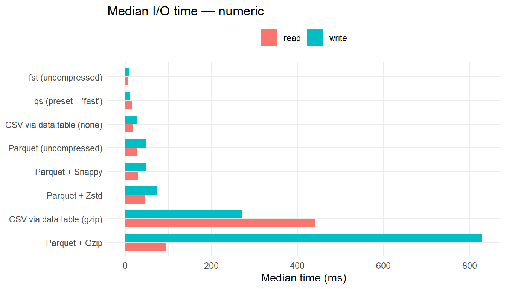
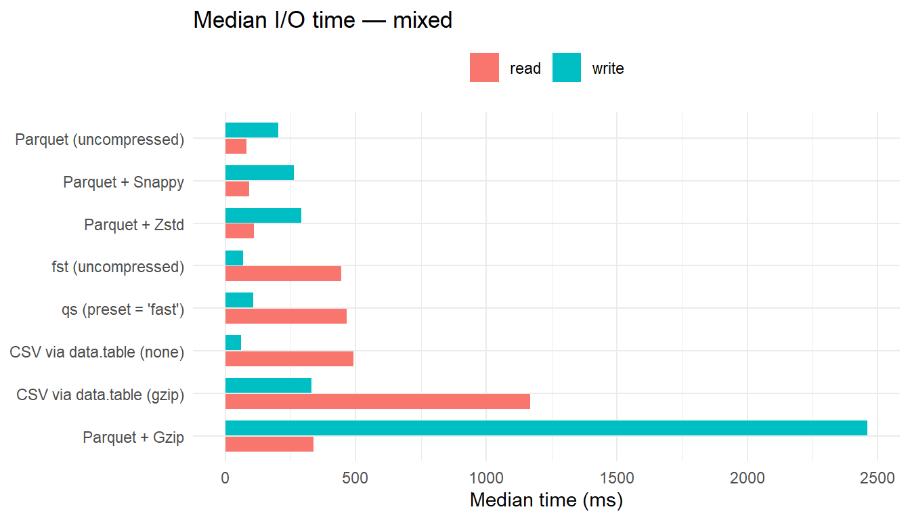

# Post summary

Following our previous exploration of data read/write performance, we now delve into the effects of different compression techniques on these processes. Compression is vital for optimizing storage efficiency and access speed. This post covers the definitions of compression methods, factors influencing compression efficiency, guidelines for using higher or lower compression, and detailed empirical testing results.

# Purpose and Motivation

Compression is essential for reducing storage requirements and improving data access times. By understanding the impact of different compression techniques, we can optimize data handling in R, making it more efficient and effective. This study explores various compression methods to provide insights into their performance in different scenarios.

# Detailed Overview of Compression Techniques

Understanding the specific characteristics and use cases of various compression techniques is crucial for optimizing data storage and access. Below, we delve deeper into the most commonly used compression methods, detailing their strengths, weaknesses, and ideal applications.

## Gzip (GNU zip)

Gzip uses the DEFLATE algorithm, which balances speed and compression ratio. It is widely supported across different platforms and programming languages, making it effective for both text and binary data. Its primary strength lies in providing a good compromise between compression speed and ratio, making it a popular choice for general-purpose compression. However, Gzip is not the fastest in terms of compression or decompression speeds, and its compression ratios are moderate compared to newer algorithms. It is ideal for general-purpose compression where compatibility and ease of use are important, such as web servers for compressing HTTP responses and archiving files where space saving is needed but not critical.

## Snappy

Snappy is optimized for speed, making it ideal for applications requiring rapid read/write operations. It excels in scenarios where quick compression and decompression are more critical than achieving the highest compression ratio. Snappy's primary strength is its high speed, both in compression and decompression, which minimizes latency in data processing. However, this comes at the cost of lower compression ratios compared to other algorithms. Snappy is best suited for real-time data processing, log compression, and systems where performance is a higher priority than storage efficiency.

## Zstandard (Zstd)

Zstandard, or Zstd, offers high compression ratios and fast decompression, making it excellent for scenarios that need high compression without significant speed loss. Zstd is highly versatile, providing various compression levels to balance speed and compression ratio according to the application's needs. Its strengths include superior compression ratios and efficient decompression speeds, often outperforming older algorithms like Gzip. One downside is that higher compression levels can be resource-intensive in terms of CPU and memory usage. Zstd is ideal for large-scale data storage, backup solutions, and systems where both speed and storage efficiency are critical.

## Brotli

Brotli achieves high compression ratios, especially for text data, making it perfect for web content. Developed by Google, Brotli provides excellent compression efficiency for web fonts and other web assets, significantly reducing file sizes and improving load times. Its primary strength lies in its ability to achieve superior compression ratios for text data, which is crucial for optimizing web performance. However, Brotli can be slower than other algorithms in both compression and decompression, particularly at higher compression levels. Brotli is best used for web content delivery, where minimizing bandwidth usage and improving load times are paramount.

## LZ4

LZ4 prioritizes speed over compression ratio, making it ideal for real-time data processing. It is designed to provide extremely fast compression and decompression, which is critical in performance-sensitive environments. LZ4's strengths include its lightning-fast speeds, which make it suitable for scenarios where data needs to be processed in real-time. However, its compression ratios are lower than those of more advanced algorithms like Zstd or Brotli. LZ4 is particularly useful for in-memory compression, real-time logging, and applications where speed is more important than achieving the highest compression ratio.

## Uncompressed

Storing data in its original format without compression ensures the fastest possible read and write speeds, as there is no overhead from compression or decompression processes. This approach is best when speed is crucial, and storage space is not a concern. The primary advantage of uncompressed data is the elimination of latency related to compression algorithms, providing immediate access to data. However, the downside is the significantly larger storage requirement. Uncompressed storage is ideal for applications where performance is paramount and storage costs are negligible, such as temporary data storage and real-time data analytics.

By understanding these compression techniques' specific advantages and limitations, you can make informed decisions to optimize data storage and access for various applications.

# Factors influencing compression efficiency

Several critical factors influence the efficiency of compression techniques, determining their suitability for different scenarios.

Data type and structure play a significant role in compression efficiency. Text data typically compresses well with algorithms like `Brotli`, which are designed to handle repetitive patterns in text efficiently. Conversely, numerical data often benefits more from algorithms like `Zstandard` (`Zstd`), which can provide higher compression ratios for such data types due to its sophisticated encoding mechanisms.

Compression levels are another crucial factor. Higher compression levels generally increase the compression ratio, resulting in smaller file sizes. However, this improvement comes at the cost of reduced speed and increased CPU and memory resource requirements. Therefore, selecting an appropriate compression level involves balancing the need for smaller file sizes against the available computational resources and required processing speeds.

CPU and memory capabilities of the hardware significantly impact compression and decompression speeds. Devices with higher processing power and more available memory can handle more intensive compression tasks more efficiently. In contrast, limited resources can bottleneck the performance, making it essential to choose a compression method that aligns with the hardware's capabilities.

Application needs also dictate the choice of compression technique. Real-time processing environments demand speed, necessitating the use of algorithms optimized for quick compression and decompression, such as Snappy or LZ4. On the other hand, archival purposes benefit from higher compression ratios to minimize storage space, making algorithms like Brotli or Zstd more suitable due to their superior compression efficiency.

Understanding these factors allows for a more informed selection of compression techniques, optimizing performance and efficiency according to specific data handling requirements and resource constraints.


# Database Structure and Compression

The structure of the database plays a crucial role in determining the efficiency of compression. For this study, we use a generated dataset that simulates real-world data complexity, enabling a comprehensive assessment of various compression techniques on read/write performance.

## Device specifications

13th‑Gen Intel Core i7‑13620H 32 GB RAM - Windows 64‑bit

## Dataset generation

We benchmark row counts 10^6, and three structures (numeric, character, mixed).  The helper below fabricates a mixed‑type frame:


``` r
knitr::opts_chunk$set(echo = TRUE, cache = TRUE)
source("utils.R")

generate_sample_data <- function(n, type = "mixed"){
  set.seed(123)
  if(type == "numeric"){
    data.frame(ID = seq_len(n), Value = rnorm(n))
  } else if(type == "character"){
    data.frame(ID = seq_len(n),
               Description = replicate(n, paste0(sample(letters,20,TRUE), 
                                                 collapse="")))
  } else {
    data.frame(
      ID          = seq_len(n),
      Value       = rnorm(n),
      Category    = sample(letters[1:5], n, TRUE),
      Description = replicate(n, paste0(sample(letters,20,TRUE), collapse=""))
    )
  }
}

sample_size <- 1e6
dt_list <- list(
  numeric   = as.data.table(generate_sample_data(sample_size, "numeric")),
  character = as.data.table(generate_sample_data(sample_size, "character")),
  mixed     = as.data.table(generate_sample_data(sample_size, "mixed"))
)
```

#  I/O function lists


``` r
## I/O function lists
write_funcs <- list(
  parquet_gzip = 
    function(d,f) arrow::write_parquet(d, f, compression = "gzip"),
  parquet_snappy = 
    function(d,f) arrow::write_parquet(d, f, compression = "snappy"),
  parquet_zstd = 
    function(d,f) arrow::write_parquet(d, f, compression = "zstd"),
  parquet_uncompressed = 
    function(d,f) arrow::write_parquet(d, f, compression = "uncompressed"),
  qs_fast = 
    function(d,f) qs::qsave(d, f, preset = "fast"),
  fst_uncompressed = 
    function(d,f) fst::write_fst(d, f, compress = 0),
  dt_gzip = 
    function(d,f) data.table::fwrite(d, f, compress = "gzip"),
  dt_none = 
    function(d,f) data.table::fwrite(d, f, compress = "none")
)

read_funcs <- list(
  parquet_gzip         = function(f) arrow::read_parquet(f),
  parquet_snappy       = function(f) arrow::read_parquet(f),
  parquet_zstd         = function(f) arrow::read_parquet(f),
  parquet_uncompressed = function(f) arrow::read_parquet(f),
  qs_fast              = function(f) qs::qread(f),
  fst_uncompressed     = function(f) fst::read_fst(f),
  dt_gzip              = function(f) data.table::fread(f),
  dt_none              = function(f) data.table::fread(f)
)
```

# Results


``` r
results <- lapply(names(dt_list), function(structure) {
  paths <- get_paths(structure)
  out   <- run_benchmarks_one(dt_list[[structure]], paths, write_funcs, 
                              read_funcs)
  out$write_summary$structure <- structure
  out$read_summary$structure  <- structure
  out$size_summary$structure  <- structure
  out
})

write_summary_all <- dplyr::bind_rows(lapply(results, `[[`, "write_summary"))
read_summary_all  <- dplyr::bind_rows(lapply(results, `[[`, "read_summary"))
size_summary_all  <- dplyr::bind_rows(lapply(results, `[[`, "size_summary"))
```

## Summarising


``` r
pretty_method <- c(
  fst_uncompressed      = "fst (uncompressed)",
  qs_fast               = "qs (preset = 'fast')",
  parquet_snappy        = "Parquet + Snappy",
  parquet_zstd          = "Parquet + Zstd",
  parquet_uncompressed  = "Parquet (uncompressed)",
  parquet_gzip          = "Parquet + Gzip",
  dt_none               = "CSV via data.table (none)",
  dt_gzip               = "CSV via data.table (gzip)"
)

write_s <- write_summary_all %>%
  dplyr::mutate(method = method_from_expr(expr)) %>%
  select(structure, method,
         write_median_ms = median,
         write_mean_ms   = mean,
         write_sd_ms     = sd)

read_s <- read_summary_all %>%
  dplyr::mutate(method = method_from_expr(expr)) %>%
  select(structure, method,
         read_median_ms = median,
         read_mean_ms   = mean,
         read_sd_ms     = sd)

cons <- write_s %>%
  inner_join(read_s, by = c("structure","method")) %>%
  left_join(size_summary_all %>%
              select(structure, method, size_MB, relative_size),
            by = c("structure","method")) %>%
  dplyr::mutate(Method = recode(method, !!!pretty_method)) %>%
  arrange(structure, write_median_ms)

unique(cons$structure) %>%
  walk(~ print_per_structure(cons, .x))

write_wide <- cons %>%
  select(structure, Method, `Write (ms)` = write_median_ms) %>%
  pivot_wider(names_from = structure, values_from = `Write (ms)`) %>%
  arrange(`mixed`)  # or order by 'numeric' etc.

knitr::kable(write_wide, digits = 1,
             caption = "Median write time (ms) by storage method and data structure")
```


Table: Median write time (ms) by storage method and data structure

|Method                    | character|  mixed| numeric|
|:-------------------------|---------:|------:|-------:|
|CSV via data.table (none) |      51.2|   79.3|    39.8|
|fst (uncompressed)        |      49.1|   84.1|     9.4|
|qs (preset = 'fast')      |      68.2|  132.2|    13.2|
|Parquet (uncompressed)    |     153.9|  263.9|    57.3|
|Parquet + Snappy          |     231.0|  337.0|    61.6|
|Parquet + Zstd            |     261.8|  378.2|    87.1|
|CSV via data.table (gzip) |     272.1|  430.7|   351.1|
|Parquet + Gzip            |    2554.5| 3118.9|  1064.5|

``` r
# Wide table: read medians
read_wide <- cons %>%
  select(structure, Method, `Read (ms)` = read_median_ms) %>%
  pivot_wider(names_from = structure, values_from = `Read (ms)`) %>%
  arrange(`mixed`)
knitr::kable(read_wide, digits = 1,
             caption = "Median read time (ms) by storage method and data structure")
```


Table: Median read time (ms) by storage method and data structure

|Method                    | character|  mixed| numeric|
|:-------------------------|---------:|------:|-------:|
|Parquet (uncompressed)    |      70.5|   89.1|    23.4|
|Parquet + Snappy          |      90.6|  111.5|    29.2|
|Parquet + Zstd            |      90.6|  128.3|    44.6|
|Parquet + Gzip            |     279.4|  373.4|   102.9|
|fst (uncompressed)        |     284.3|  504.5|     7.4|
|qs (preset = 'fast')      |     316.6|  543.1|    15.3|
|CSV via data.table (none) |     351.0|  579.7|    22.1|
|CSV via data.table (gzip) |     860.3| 1423.7|   513.9|

``` r
# Wide table: sizes
size_wide <- cons %>%
  select(structure, Method, `Size (MB)` = size_MB) %>%
  pivot_wider(names_from = structure, values_from = `Size (MB)`)
knitr::kable(size_wide, digits = 2,
             caption = "File size (MB) by method and structure")
```


Table: File size (MB) by method and structure

|Method                    | character| mixed| numeric|
|:-------------------------|---------:|-----:|-------:|
|fst (uncompressed)        |     26.83| 39.35|   11.44|
|CSV via data.table (none) |     27.55| 46.78|   24.84|
|qs (preset = 'fast')      |     23.94| 32.49|   11.49|
|Parquet (uncompressed)    |     27.35| 35.61|   12.28|
|Parquet + Snappy          |     25.28| 33.54|   12.28|
|Parquet + Zstd            |     15.46| 23.35|   10.67|
|CSV via data.table (gzip) |     15.80| 26.64|   10.53|
|Parquet + Gzip            |     15.30| 23.19|    9.41|


``` r
method_from_expr <- function(expr) sub("^write_|^read_", "", expr)

# Prepare write and read with ratios
write_s <- write_summary_all %>%
  mutate(method = method_from_expr(expr)) %>%
  select(structure, method, write_median_ms = median) %>%
  normalise_ratio("write_median_ms")

read_s <- read_summary_all %>%
  mutate(method = method_from_expr(expr)) %>%
  select(structure, method, read_median_ms = median) %>%
  normalise_ratio("read_median_ms")

# Prepare sizes with ratio to smallest
size_s <- size_summary_all %>%
  normalise_ratio("size_MB") %>%
  select(structure, method, size_MB, size_MB_ratio)

# Join all
consolidated_ratio <- write_s %>%
  inner_join(read_s,  by = c("structure", "method")) %>%
  left_join(size_s,   by = c("structure", "method")) %>%
  mutate(Method = recode(method, !!!pretty_method)) %>%
  arrange(structure, write_median_ms)

knitr::kable(
  consolidated_ratio %>%
    select(structure, Method,
           `Write (ms)` = write_median_ms,
           `Write (×)`  = write_median_ms_ratio,
           `Read (ms)`  = read_median_ms,
           `Read (×)`   = read_median_ms_ratio,
           `Size (MB)`  = size_MB,
           `Size (×)`   = size_MB_ratio),
  digits = 2,
  caption = "Median write/read times and file size with ratios (from fastest/smallest) by method and structure"
)
```


Table: Median write/read times and file size with ratios (from fastest/smallest) by method and structure

|structure |Method                    | Write (ms)| Write (×)| Read (ms)| Read (×)| Size (MB)| Size (×)|
|:---------|:-------------------------|----------:|---------:|---------:|--------:|---------:|--------:|
|character |fst (uncompressed)        |      49.09|      1.00|    284.26|     4.03|     26.83|     1.75|
|character |CSV via data.table (none) |      51.24|      1.04|    351.03|     4.98|     27.55|     1.80|
|character |qs (preset = 'fast')      |      68.24|      1.39|    316.63|     4.49|     23.94|     1.56|
|character |Parquet (uncompressed)    |     153.93|      3.14|     70.46|     1.00|     27.35|     1.79|
|character |Parquet + Snappy          |     231.00|      4.71|     90.58|     1.29|     25.28|     1.65|
|character |Parquet + Zstd            |     261.80|      5.33|     90.57|     1.29|     15.46|     1.01|
|character |CSV via data.table (gzip) |     272.08|      5.54|    860.33|    12.21|     15.80|     1.03|
|character |Parquet + Gzip            |    2554.47|     52.03|    279.42|     3.97|     15.30|     1.00|
|mixed     |CSV via data.table (none) |      79.29|      1.00|    579.71|     6.50|     46.78|     2.02|
|mixed     |fst (uncompressed)        |      84.08|      1.06|    504.49|     5.66|     39.35|     1.70|
|mixed     |qs (preset = 'fast')      |     132.15|      1.67|    543.09|     6.09|     32.49|     1.40|
|mixed     |Parquet (uncompressed)    |     263.93|      3.33|     89.12|     1.00|     35.61|     1.54|
|mixed     |Parquet + Snappy          |     336.95|      4.25|    111.47|     1.25|     33.54|     1.45|
|mixed     |Parquet + Zstd            |     378.18|      4.77|    128.35|     1.44|     23.35|     1.01|
|mixed     |CSV via data.table (gzip) |     430.68|      5.43|   1423.70|    15.97|     26.64|     1.15|
|mixed     |Parquet + Gzip            |    3118.90|     39.33|    373.41|     4.19|     23.19|     1.00|
|numeric   |fst (uncompressed)        |       9.36|      1.00|      7.39|     1.00|     11.44|     1.22|
|numeric   |qs (preset = 'fast')      |      13.25|      1.42|     15.32|     2.07|     11.49|     1.22|
|numeric   |CSV via data.table (none) |      39.76|      4.25|     22.10|     2.99|     24.84|     2.64|
|numeric   |Parquet (uncompressed)    |      57.26|      6.12|     23.37|     3.16|     12.28|     1.30|
|numeric   |Parquet + Snappy          |      61.60|      6.58|     29.18|     3.95|     12.28|     1.31|
|numeric   |Parquet + Zstd            |      87.07|      9.30|     44.65|     6.04|     10.67|     1.13|
|numeric   |CSV via data.table (gzip) |     351.07|     37.51|    513.90|    69.52|     10.53|     1.12|
|numeric   |Parquet + Gzip            |    1064.50|    113.74|    102.87|    13.92|      9.41|     1.00|

## Throughput plot


``` r
# Plot labels
plot_df <- bind_rows(
  dplyr::mutate(write_summary_all, phase = "write"),
  dplyr::mutate(read_summary_all,  phase = "read")
) %>%
  dplyr::mutate(method = sub("^(write|read)_", "", expr),
         Method = dplyr::recode(method, !!!pretty_method))

unique(plot_df$structure) %>%
  walk(~ print(make_structure_plot(.x, log_scale = FALSE)))
```

<!-- --><!-- --><!-- -->

# Conclusions

**Key take-aways from the 1 M-row datasets (50 replicates; three structures: numeric, character, mixed).**

| Phase   | Structure   | Fastest median (ms)                 | Slowest median (ms)            | Spread (×) |
|:--------|:------------|:------------------------------------|:-------------------------------|-----------:|
| Write   | numeric     | `fst` (uncompressed) $\approx 10.4$     | Parquet + Gzip $\approx 1033.5$    | 103×       |
| Write   | character   | `fst` (uncompressed) $\approx 56.4$     | Parquet + Gzip $\approx 2727.7$    | 49×        |
| Write   | mixed       | `fst` (uncompressed) $\approx 71.6$     | Parquet + Gzip $\approx 3265.9$    | 45×        |
| Read    | numeric     | `fst` (uncompressed) $\approx 5.8$      | CSV + Gzip $\approx 404.1$         | 69×        |
| Read    | character   | Parquet (uncompressed) $\approx 51.9$   | CSV + Gzip $\approx 791.6$         | 15×        |
| Read    | mixed       | Parquet (uncompressed) $\approx 123.8$  | CSV + Gzip $\approx 1655.1$        | 13×        |

### Interpretation

- **Write path**
  - Uncompressed `fst` is the fastest writer across all structures.  
  - `qs` (`preset = "fast"`) is consistently the next best, offering strong throughput with modest size reduction.  
  - Parquet with Gzip is the slowest writer by a large margin in all cases.

- **Read path**
  - For **numeric** data, uncompressed `fst` is the fastest reader.
  - For **character** and **mixed** data, **Parquet (uncompressed)** yields the lowest read latency, with **Snappy** and **Zstd** close behind; these formats benefit from reduced on-disk size that offsets decompression overhead.  
  - `CSV` + `Gzip` is consistently the slowest reader, particularly for mixed data.

- **File size**
  - **Zstd** and **Gzip** deliver the smallest files across structures.  
  - **Snappy** and **qs** strike a practical balance, with much smaller than uncompressed, and materially better write/read performance than Gzip.  
  - `CSV` is largest on disk; `CSV` + `Gzip` is smaller but slow to read.

### Practical perspective

- **High-frequency writes** should prefer uncompressed `fst` (numeric-heavy) or `qs` (mixed/character) to maximise throughput.  
- **Read-optimised pipelines** should prefer Parquet (uncompressed) for minimum latency, or Parquet + Snappy/Zstd when storage reduction matters with minimal read-time penalty.  
- **Archival or size-constrained storage** should favour Parquet + Zstd (or Gzip when maximum compression is required and slower I/O is acceptable).

**Did you find this page helpful? Consider sharing it 🙌**

<style>
/* ====== Post-only layout + typography polish (Hugo Blox / Tailwind) ====== */
/* Place this at the very end of the post so it wins the cascade. */

/* 0) Widen the page shell Hugo Blox uses around articles */
.page-body > .mx-auto,
.page-body .max-w-screen-xl{
  max-width: 100vw !important;
  width: 100% !important;
  padding-left: 0 !important;
  padding-right: 0 !important;
}

/* 1) Remove the Tailwind max-w cap on the <main> inside <article> */
.page-body article > main{
  max-width: none !important;  /* beats .max-w-6xl */
  width: 100% !important;
}

/* 2) Control the actual reading width (fluid per breakpoint) */
.page-body article .prose{
  /* Base: a touch larger with comfy line height */
  font-size: clamp(1rem, 0.96rem + 0.25vw, 1.12rem);
  line-height: 1.75;
  text-align: left;
  margin-inline: auto;

  /* Reading width: scale up on big screens, but keep lines readable */
  max-width: 86ch !important; /* default desktop */
}
@media (min-width: 1024px){  /* lg */
  .page-body article .prose{ max-width: 96ch !important; }
}
@media (min-width: 1280px){  /* xl */
  .page-body article .prose{ max-width: 102ch !important; }
}
@media (min-width: 1536px){  /* 2xl / very wide */
  .page-body article .prose{ max-width: 108ch !important; }
}

/* 3) Phones/tablets: full width with side padding */
@media (max-width: 768px){
  .page-body article .prose{
    max-width: 100% !important;
    padding-inline: 1rem;
  }
}

/* 4) Give the article more room by slimming sidebars on wide screens */
@media (min-width: 1280px){
  .hb-sidebar-container, .hb-toc { width: 12rem !important; } /* was 16rem */
}
@media (max-width: 1279.98px){
  .hb-sidebar-container{ display:none !important; } /* hide sidebar under xl */
}

/* --------- Clean, professional type polish (scoped to post content) -------- */
.page-body article .prose p{
  margin: 0 0 1.15em;
  text-wrap: pretty;
  hyphens: auto;
}

.page-body article .prose h1{
  font-size: clamp(1.9rem, 1.6rem + 1.2vw, 2.3rem);
  margin: 1.2em 0 .5em;
  padding-bottom: .25em;
  border-bottom: 2px solid #e5e7eb;
}
.page-body article .prose h2{
  font-size: clamp(1.4rem, 1.2rem + 0.6vw, 1.7rem);
  margin: 1.35em 0 .4em;
  padding-bottom: .2em;
  border-bottom: 1px solid #e5e7eb;
}
.page-body article .prose h3{
  font-size: clamp(1.15rem, 1.05rem + 0.35vw, 1.35rem);
  margin: 1.1em 0 .3em;
}

/* Links: subtle underline-on-hover */
.page-body article .prose a{
  color: #2f6ab5;
  text-decoration: none;
  border-bottom: 1px solid rgba(47,106,181,.25);
}
.page-body article .prose a:hover{
  color: #1f4f8f;
  border-bottom-color: currentColor;
}

/* Code blocks & inline code */
.page-body article .prose pre{
  background: #f6f8fa;
  border: 1px solid #e5e7eb;
  border-radius: 8px;
  padding: 12px 14px;
  overflow: auto;
}
.page-body article .prose code{
  background: #f6f8fa;
  border: 1px solid #e5e7eb;
  border-radius: 5px;
  padding: .15em .35em;
  font-size: .95em;
}
.page-body article .prose pre code{
  background: none; border: 0; padding: 0; font-size: 0.95em;
}

/* Tables */
.page-body article .prose table{
  width: 100%;
  border-collapse: collapse;
  margin: 1.2rem 0;
  font-variant-numeric: tabular-nums;
}
.page-body article .prose th,
.page-body article .prose td{
  border: 1px solid #e5e7eb;
  padding: .6rem .75rem;
}
.page-body article .prose thead th{
  background: #2f6ab5;
  color: #fff;
  text-align: left;
}

/* Images & figures */
.page-body article .prose img{ border-radius: 6px; }

/* Optional: allow “full-bleed” wide elements
   Add class="wide" to a block (table/pre/img wrapper) to span the viewport. */
.page-body article .prose .wide{
  width: 100vw;
  position: relative;
  left: 50%;
  right: 50%;
  margin-left: -50vw;
  margin-right: -50vw;
  padding-inline: clamp(12px, 4vw, 36px);
}

/* Footer timestamp spacing */
.page-body article time{ margin-top: 2rem; display: block; }

/* Dark mode tweaks */
html.dark .page-body article .prose pre,
html.dark .page-body article .prose code{
  background: #111826;
  border-color: #253041;
}
html.dark .page-body article .prose thead th{ background: #5aa0ff; }
</style>
