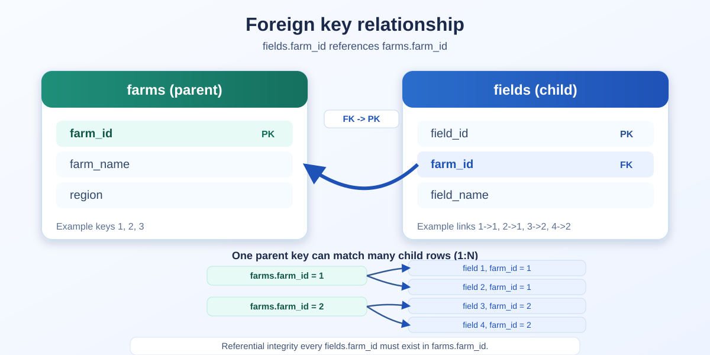
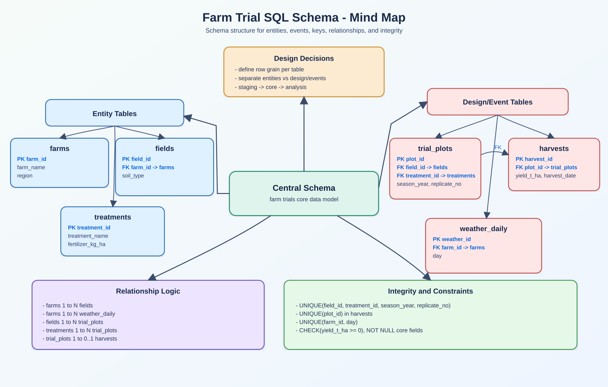
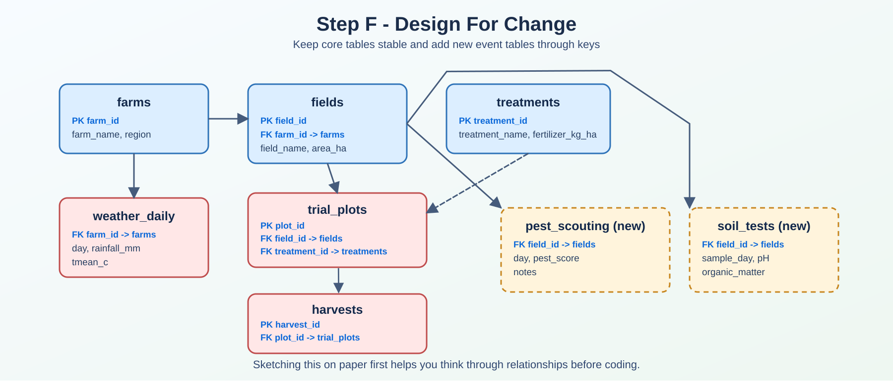
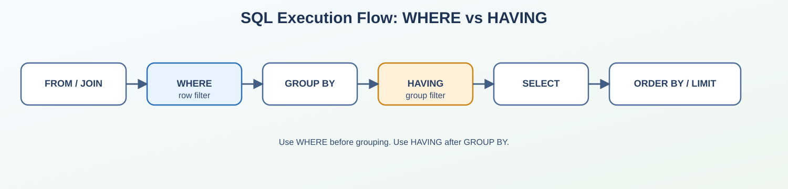
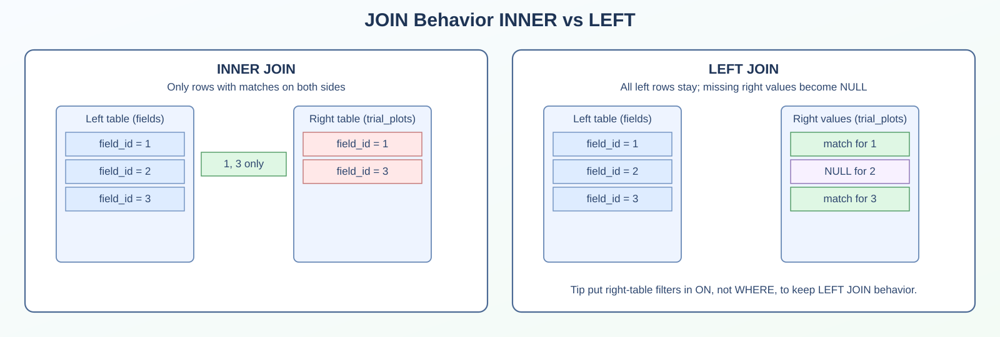
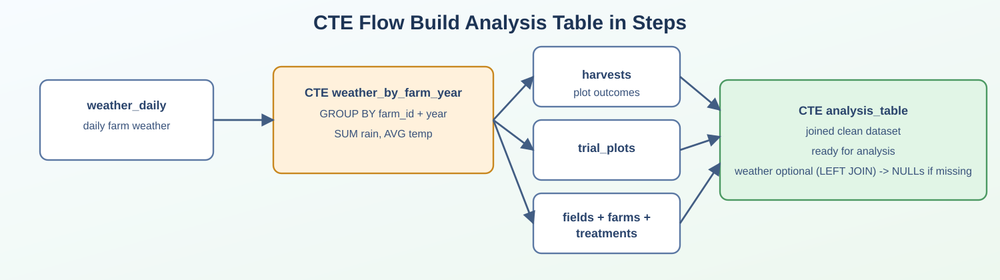
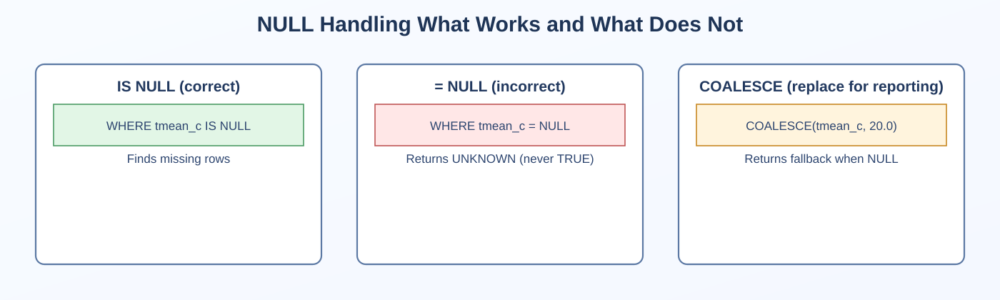
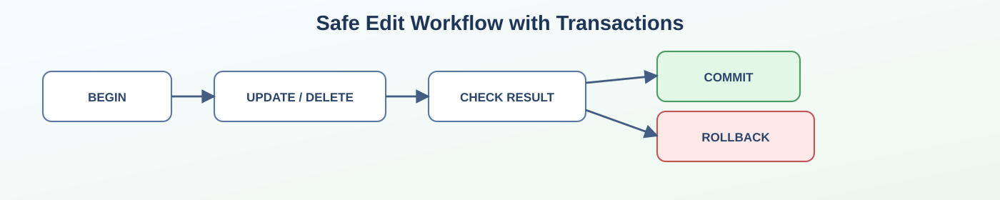

# Table of contents

- [1) Why SQL matters in agriculture analytics](#why-sql-matters-in-agriculture-analytics)
- [2) What is a table, row, column? What is a key?](#what-is-a-table-row-column-what-is-a-key)
- [3) The data story as an illustrative simple field trial dataset](#the-data-story-as-an-illustrative-simple-field-trial-dataset)
- [4) Create the schema (PostgreSQL)](#create-the-schema-postgresql)
- [5) Insert a small sample dataset](#insert-a-small-sample-dataset)
- [6) SQL queries in increasing difficulty](#sql-queries-in-increasing-difficulty)
- [7) Quick recap of common mistakes](#quick-recap-of-common-mistakes)

In this post we move from SQL fundamentals to a practical farm trial workflow. We cover tables and keys, schema design, data loading, core queries, quality checks, and clear interpretation limits.

# 1) Why SQL matters in agriculture analytics

As a statistician working with agriculture and breeding data, I can tell you that SQL is one of the most useful skills you can learn if you work with yield, field trials, weather, soil, or farm performance.

If spreadsheets are your current home, think of SQL as the next level for at least two main reasons:

- A spreadsheet is great for a few tabs and a few thousand rows.
- SQL databases are better when data grows, when multiple people use the same data, and when you need repeatable analysis.

In agriculture, this happens quickly. Examples:

- One farm becomes multiple farms.
- One season becomes multi year comparisons.
- One file becomes many sources (harvests, weather, field metadata, treatments).

Without SQL, people copy-paste and make accidental mistakes.
With SQL, you ask clear questions and get reproducible answers.

Another reason this matters in field trial work is that your SQL query becomes a transparent analysis recipe. If someone asks "how did you compute that treatment average?", you can show the exact logic instead of manually reconstructing spreadsheet steps.

A few real questions SQL helps you answer are:

- Which treatment had the best average yield in 2025?
- Did the response differ by region?
- Which fields are missing weather data?
- Are there duplicate harvest records?

I also want to prevent a common beginner frustration such as writing queries that "kind of work" but return the wrong rows. I will show you exactly how to avoid the classic pitfalls (especially forgetting `WHERE`, confusing `NULL`, and using the wrong type of join).

# 2) What is a table, row, column? What is a key?

Before writing SQL, let us define the core concepts in plain language.

## Table

A table is like a spreadsheet tab.

Example `fields` table.
It stores one type of thing (fields).

## Row

A row is one record.

Example one row in `fields` might be `field_id = 101`, `field_name = 'North 01'`.

## Column

A column is one variable.

Example `soil_type` is a column.

## Primary key

A primary key is a column (or combination of columns) that uniquely identifies each row.

Example `farm_id` in `farms`.
No duplicates, no missing values.
Think of it like a unique ID card.

## Foreign key

A foreign key links one table to another.

Example `fields.farm_id` points to `farms.farm_id`.
It enforces consistency every field must belong to a real farm.

A possible analogy is to think about filing cabinets.

Primary key = unique folder number inside one cabinet.
Foreign key = reference to a folder in another cabinet.

**This is what allows us to connect tables correctly with joins.**



*Figure. Foreign key relationship example. `fields.farm_id` must match an existing `farms.farm_id`, creating a reliable one-to-many link for joins.*

# 3) The data story as an illustrative simple field trial dataset

Let us imagine a realistic but small trial program. You manage three farms in different regions. Each farm has fields. In each field, you test fertilizer treatments across seasons. You also collect daily weather at farm level.

Our dataset has five tables

1. `farms` one row per farm.
2. `fields` one row per field (each field belongs to a farm).
3. `treatments` one row per treatment level.
4. `harvests` one row per harvested field treatment season result.
5. `weather_daily` one row per farm day weather record.

This structure is very common in production analytics, and can be seen as

"Entity" tables (farm, field, treatment) describe the system.
"Event" tables (harvest, daily weather) store repeated observations over time.

Note that this structure is not only "database theory". It directly affects analysis quality because

if farm/field metadata are separated cleanly from events, joins are simpler and less error prone.
if everything is in one giant table, duplicates and inconsistent updates become much more likely.
good schema design is one of the easiest ways to reduce analysis mistakes before they happen.

## 3.1) How to design an SQL schema (using this farm example)

If you are just starting, schema design may feel abstract. A practical way to think is to answer these questions first

1. What decisions/questions do I need to answer?
2. What "things" exist in my system?
3. What events happen over time?
4. What should be unique, and what should be linked?

In this farm trial example, we separate entities from events and focus on treatment response, missing records, and weather context.



*Figure. Schema design mind map for this tutorial. Blue labels indicate the variables that link tables.*

### How each table looks (and how they connect)

`farms` (parent table)

| farm_id | farm_name         | region  |
|---:|-------------------|---------|
| 1 | Green Valley Farm | North   |
| 2 | Riverbend Farm    | Central |
| 3 | Sunrise Farm      | South   |

`fields` (each field belongs to a farm through `farm_id`)

| field_id | farm_id | field_name  | area_ha | soil_type  |
|---:|---:|-----------|---:|------------|
| 1 | 1 | North-01   | 12.50 | clay_loam  |
| 3 | 2 | Central-01 | 15.20 | silt_loam  |
| 5 | 3 | South-01   | 14.10 | sandy      |

`treatments` (reference table for treatment definitions)

| treatment_id | treatment_name  | fertilizer_kg_ha |
|---:|-----------------|---:|
| 1 | Control         | 0   |
| 2 | Nitrogen_Low    | 60  |
| 3 | Nitrogen_Medium | 120 |

`harvests` (event table linking `field_id` + `treatment_id`)

| harvest_id | field_id | treatment_id | season_year | yield_t_ha |
|---:|---:|---:|---:|---:|
| 1  | 1 | 1 | 2024 | 6.20 |
| 10 | 3 | 2 | 2024 | 7.60 |
| 12 | 3 | 3 | 2025 | 7.90 |

`weather_daily` (event table linked to farms by `farm_id`)

| weather_id | farm_id | day        | rainfall_mm | tmean_c |
|---:|---:|------------|---:|---:|
| 1  | 1 | 2024-06-01 | 12.4 | 18.5 |
| 7  | 2 | 2024-06-01 | 8.1  | 20.0 |
| 10 | 2 | 2025-06-01 | 10.5 | 19.4 |

Link summary

`fields.farm_id` links with `farms.farm_id`.
`harvests.field_id` links with `fields.field_id`.
`harvests.treatment_id` links with `treatments.treatment_id`.
`weather_daily.farm_id` links with `farms.farm_id`.

The core idea is that `harvests` connects agronomic outcomes to both location (`fields`/`farms`) and treatment (`treatments`), while `weather_daily` connects environmental context to the same farms.

### Step A define table grain first

`Grain` means "what one row represents".

Entity tables (`farms`, `fields`, `treatments`) one row per entity.
Event tables (`harvests`, `weather_daily`) one row per time based observation.

If grain is unclear, everything after that gets messy (duplicates, wrong joins, wrong counts).

### Step B choose primary keys and foreign keys

Use the same linking variables shown above and enforce them with primary keys (IDs in parent tables) and foreign keys (matching IDs in child/event tables).

This gives you safe joins and enforces referential integrity.

### Step C define business uniqueness with constraints

Primary keys identify rows technically, but you also need domain level uniqueness.

Examples for this project

in `harvests`, you usually expect one row per `field_id + treatment_id + season_year`.
in `weather_daily`, you usually expect one row per `farm_id + day`.

That can be enforced with unique constraints

```sql
ALTER TABLE harvests
ADD CONSTRAINT uq_harvest_field_treat_year
UNIQUE (field_id, treatment_id, season_year);

ALTER TABLE weather_daily
ADD CONSTRAINT uq_weather_farm_day
UNIQUE (farm_id, day);
```

This protects your analysis from duplicate event records.

### Step D pick data types and validation rules

Use types and constraints to prevent bad data early.

`DATE` for dates (`harvest_date`, `day`).
numeric types for quantities (`yield_t_ha`, `rainfall_mm`, `area_ha`).
`NOT NULL` for required fields.
`CHECK` for physical logic (for example non negative yield).

Your schema is the first quality control layer.

### Step E separate raw ingestion from clean analytics

A practical production pattern

1. Load external files into staging tables.
2. Validate and standardize.
3. Insert into core relational tables (`farms`, `fields`, `harvests`, `weather_daily`).
4. Build analysis views/CTEs from the clean core.

This keeps raw import problems away from final reporting.

### Step F design for change

Field trial data evolves. Plan for that.

A practical habit is to sketch the schema on a piece of paper first. Writing it by hand is often the best way to think through table grain and links before coding.



*Figure. Extension ready schema sketch with added event tables (for example `pest_scouting` and `soil_tests`).*

new treatment levels can be added without redesigning harvest table.
new farms/fields can be inserted without touching historical records.
additional event tables (for example pest scouting, soil tests) can be linked by keys.

Good schema design makes future extension easier and safer.

### Mini design checklist (farm trial version)

Is each table grain explicit?
Are primary and foreign keys defined?
Are business level uniqueness constraints present?
Are required columns `NOT NULL` where appropriate?
Are sanity checks (`CHECK`) defined for critical numeric values?
Can you answer your main trial questions with straightforward joins?

# 4) Create the schema (PostgreSQL)

Below is a clean schema for the five required tables. I will use PostgreSQL syntax and keep it beginner friendly.

```sql
-- Optional cleanup if you are re-running this tutorial script.
-- Drop child tables first (they depend on parent tables).
DROP TABLE IF EXISTS harvests;
DROP TABLE IF EXISTS weather_daily;
DROP TABLE IF EXISTS fields;
DROP TABLE IF EXISTS treatments;
DROP TABLE IF EXISTS farms;

-- 1) Farms table
CREATE TABLE farms (
    farm_id INT GENERATED ALWAYS AS IDENTITY PRIMARY KEY,
    farm_name TEXT NOT NULL,
    region TEXT NOT NULL
);

-- 2) Fields table
CREATE TABLE fields (
    field_id INT GENERATED ALWAYS AS IDENTITY PRIMARY KEY,
    farm_id INT NOT NULL,
    field_name TEXT NOT NULL,
    area_ha NUMERIC(8,2) NOT NULL,
    soil_type TEXT NOT NULL,
    CONSTRAINT fk_fields_farm
        FOREIGN KEY (farm_id) REFERENCES farms (farm_id)
);

-- 3) Treatments table
CREATE TABLE treatments (
    treatment_id INT GENERATED ALWAYS AS IDENTITY PRIMARY KEY,
    treatment_name TEXT NOT NULL,
    fertilizer_kg_ha NUMERIC(8,2) NOT NULL
);

-- 4) Harvests table
CREATE TABLE harvests (
    harvest_id INT GENERATED ALWAYS AS IDENTITY PRIMARY KEY,
    field_id INT NOT NULL,
    treatment_id INT NOT NULL,
    season_year INT NOT NULL,
    yield_t_ha NUMERIC(8,2) NOT NULL,
    harvest_date DATE NOT NULL,
    CONSTRAINT fk_harvests_field
        FOREIGN KEY (field_id) REFERENCES fields (field_id),
    CONSTRAINT fk_harvests_treatment
        FOREIGN KEY (treatment_id) REFERENCES treatments (treatment_id),
    CONSTRAINT chk_nonnegative_yield
        CHECK (yield_t_ha >= 0)
);

-- 5) Daily weather table
CREATE TABLE weather_daily (
    weather_id INT GENERATED ALWAYS AS IDENTITY PRIMARY KEY,
    farm_id INT NOT NULL,
    day DATE NOT NULL,
    rainfall_mm NUMERIC(8,2) NOT NULL,
    tmean_c NUMERIC(5,2),
    CONSTRAINT fk_weather_farm
        FOREIGN KEY (farm_id) REFERENCES farms (farm_id)
);
```

### Line by line explanation (key points)

1. `GENERATED ALWAYS AS IDENTITY` auto incrementing IDs.
2. `PRIMARY KEY` unique row identity.
3. `NOT NULL` value must be present.
4. `FOREIGN KEY (...) REFERENCES ...` links tables and protects data integrity.
5. `CHECK (yield_t_ha >= 0)` prevents impossible negative yield values.

### PostgreSQL vs Oracle notes (schema)

PostgreSQL and Oracle both support identity columns (`GENERATED ... AS IDENTITY`).
Older PostgreSQL tutorials often use `SERIAL`; Oracle does not use `SERIAL`.
`TEXT` is PostgreSQL specific; in Oracle you usually use `VARCHAR2(...)`.

# 5) Insert a small sample dataset

Now we load enough rows to practice filtering, joining, grouping, and quality checks.

In production work this is not the most common way to load data. Most teams load SQL tables from CSV files, data pipelines, ETL or ELT tools, application jobs, or direct connectors from source systems. Here we use direct `INSERT` statements only to simplify the idea and keep the tutorial fully reproducible in one place.

```sql
-- Farms
INSERT INTO farms (farm_name, region) VALUES
('Green Valley Farm', 'North'),
('Riverbend Farm', 'Central'),
('Sunrise Farm', 'South');

-- Fields
INSERT INTO fields (farm_id, field_name, area_ha, soil_type) VALUES
(1, 'North-01',   12.50, 'clay_loam'),
(1, 'North-02',   10.00, 'sandy_loam'),
(2, 'Central-01', 15.20, 'silt_loam'),
(2, 'Central-02',  9.80, 'clay'),
(3, 'South-01',   14.10, 'sandy'),
(3, 'South-02',   11.40, 'loam');

-- Treatments
INSERT INTO treatments (treatment_name, fertilizer_kg_ha) VALUES
('Control', 0),
('Nitrogen_Low', 60),
('Nitrogen_Medium', 120),
('Nitrogen_High', 180);

-- Harvests
INSERT INTO harvests (field_id, treatment_id, season_year, yield_t_ha, harvest_date) VALUES
(1, 1, 2024, 6.20, '2024-10-05'),
(1, 3, 2024, 7.00, '2024-10-05'),
(1, 1, 2025, 6.10, '2025-10-06'),
(1, 4, 2025, 7.40, '2025-10-06'),

(2, 1, 2024, 5.50, '2024-10-07'),
(2, 3, 2024, 6.40, '2024-10-07'),
(2, 1, 2025, 5.40, '2025-10-07'),
(2, 4, 2025, 6.80, '2025-10-07'),

(3, 1, 2024, 7.10, '2024-10-10'),
(3, 2, 2024, 7.60, '2024-10-10'),
(3, 1, 2025, 6.90, '2025-10-11'),
(3, 3, 2025, 7.90, '2025-10-11'),

(4, 1, 2024, 6.80, '2024-10-09'),
(4, 2, 2024, 7.20, '2024-10-09'),
(4, 1, 2025, 6.70, '2025-10-10'),
(4, 3, 2025, 7.60, '2025-10-10'),

(5, 1, 2024, 4.90, '2024-10-12'),
(5, 2, 2024, 5.60, '2024-10-12'),
(5, 1, 2025, 4.70, '2025-10-12'),
(5, 3, 2025, 5.90, '2025-10-12'),

(6, 1, 2024, 5.30, '2024-10-13'),
(6, 2, 2024, 5.90, '2024-10-13'),
(6, 1, 2025, 5.10, '2025-10-13'),
(6, 3, 2025, 6.20, '2025-10-13');

-- Weather daily (with some missing tmean_c to teach NULL handling)
INSERT INTO weather_daily (farm_id, day, rainfall_mm, tmean_c) VALUES
(1, '2024-06-01', 12.4, 18.5),
(1, '2024-06-02',  0.0, 19.1),
(1, '2024-06-03',  5.2, NULL),
(1, '2025-06-01', 18.0, 17.9),
(1, '2025-06-02',  2.5, 18.4),
(1, '2025-06-03',  0.0, 20.2),

(2, '2024-06-01',  8.1, 20.0),
(2, '2024-06-02',  1.2, 21.3),
(2, '2024-06-03',  0.0, 22.1),
(2, '2025-06-01', 10.5, 19.4),
(2, '2025-06-02',  3.0, NULL),
(2, '2025-06-03',  0.0, 20.1),

(3, '2024-06-01',  2.0, 23.8),
(3, '2024-06-02',  0.0, 24.5),
(3, '2024-06-03',  0.0, 25.0),
(3, '2025-06-01',  1.0, 24.1),
(3, '2025-06-02',  0.0, NULL),
(3, '2025-06-03',  0.0, 24.9);
```

# 6) SQL queries in increasing difficulty

From this point, every query has SQL code
line by line explanation
a small illustrative expected result

## 6.1 SELECT columns and SELECT *

### Query A specific columns

```sql
SELECT farm_id, farm_name, region
FROM farms;
```

Line by line

1. `SELECT farm_id, farm_name, region` choose exactly the columns you want.
2. `FROM farms` read rows from the `farms` table.

Expected result (illustrative)

| farm_id | farm_name         | region  |
|---:|-------------------|---------|
| 1 | Green Valley Farm | North   |
| 2 | Riverbend Farm    | Central |
| 3 | Sunrise Farm      | South   |

### Query B all columns with `*`

```sql
SELECT *
FROM treatments;
```

Line by line

1. `SELECT *` return all columns in the table.
2. `FROM treatments` source table.

Expected result (illustrative)

| treatment_id | treatment_name   | fertilizer_kg_ha |
|---:|------------------|---:|
| 1 | Control          | 0   |
| 2 | Nitrogen_Low     | 60  |
| 3 | Nitrogen_Medium  | 120 |
| 4 | Nitrogen_High    | 180 |

Note that `SELECT *` is fine for quick exploration.
For analysis scripts, prefer explicit columns so your query is stable if table structure changes.

## 6.2 WHERE filters (numbers, text, dates) and AND/OR

### Query C numeric filter

```sql
SELECT field_id, field_name, area_ha
FROM fields
WHERE area_ha >= 12.0;
```

Line by line

1. `SELECT ...` keep only key columns for this question.
2. `FROM fields` table with field attributes.
3. `WHERE area_ha >= 12.0` keep only fields at least 12 hectares.

Expected result (illustrative)

| field_id | field_name  | area_ha |
|---:|-----------|---:|
| 1 | North-01   | 12.50 |
| 3 | Central-01 | 15.20 |
| 5 | South-01   | 14.10 |

### Query D year + date + AND

```sql
SELECT harvest_id, field_id, season_year, yield_t_ha, harvest_date
FROM harvests
WHERE season_year = 2025
  AND harvest_date >= '2025-10-10';
```

Line by line

1. `season_year = 2025` keep records from 2025 season.
2. `AND` both conditions must be true.
3. `harvest_date >= '2025 10 10'` keep later harvest dates.

Expected result (illustrative)

| harvest_id | field_id | season_year | yield_t_ha | harvest_date |
|---:|---:|---:|---:|------------|
| 12 | 3 | 2025 | 7.90 | 2025-10-11 |
| 16 | 4 | 2025 | 7.60 | 2025-10-10 |
| 20 | 5 | 2025 | 5.90 | 2025-10-12 |

### Query E OR condition

```sql
SELECT farm_id, farm_name, region
FROM farms
WHERE region = 'North'
   OR region = 'South';
```

Line by line

1. `region = 'North' OR region = 'South'` either condition can match.

Expected result (illustrative)

| farm_id | farm_name         | region |
|---:|-------------------|--------|
| 1 | Green Valley Farm | North  |
| 3 | Sunrise Farm      | South  |

A common mistake warning would be that `OR` can return many more rows than expected.
Always sanity check row counts after broad filters.

### PostgreSQL vs Oracle notes (WHERE)

Text comparison with `=` works similarly in both.
Date literals are safest as `DATE 'YYYY MM DD'` in Oracle.
PostgreSQL accepts `'YYYY MM DD'` directly for a `DATE` column.

## 6.3 ORDER BY and LIMIT

### Query F top yields

```sql
SELECT harvest_id, field_id, season_year, yield_t_ha
FROM harvests
ORDER BY yield_t_ha DESC
LIMIT 5;
```

Line by line

1. `ORDER BY yield_t_ha DESC` sort from highest yield to lowest.
2. `LIMIT 5` keep only first 5 rows after sorting.

Expected result (illustrative)

| harvest_id | field_id | season_year | yield_t_ha |
|---:|---:|---:|---:|
| 12 | 3 | 2025 | 7.90 |
| 10 | 3 | 2024 | 7.60 |
| 16 | 4 | 2025 | 7.60 |
| 4  | 1 | 2025 | 7.40 |
| 14 | 4 | 2024 | 7.20 |

### PostgreSQL vs Oracle notes (ORDER BY/LIMIT)

PostgreSQL `LIMIT 5`.
Oracle `FETCH FIRST 5 ROWS ONLY` (after `ORDER BY`).

## 6.4 Aggregates COUNT, AVG, SUM, GROUP BY, HAVING



*Figure. Query flow reminder `WHERE` filters rows before grouping, `HAVING` filters groups after `GROUP BY`.*

### Query G average yield by treatment

```sql
SELECT
    t.treatment_name,
    COUNT(*) AS n_harvests,
    ROUND(AVG(h.yield_t_ha), 2) AS avg_yield_t_ha,
    ROUND(SUM(h.yield_t_ha), 2) AS total_yield_t_ha
FROM harvests h
JOIN treatments t
    ON h.treatment_id = t.treatment_id
GROUP BY t.treatment_name
ORDER BY avg_yield_t_ha DESC;
```

Line by line

1. `COUNT(*)` number of rows in each group.
2. `AVG(...)` average yield in each group.
3. `SUM(...)` total yield in each group.
4. `JOIN treatments` bring treatment names.
5. `GROUP BY t.treatment_name` one summary row per treatment.
6. `ORDER BY avg_yield_t_ha DESC` best average first.

Expected result (illustrative)

| treatment_name  | n_harvests | avg_yield_t_ha | total_yield_t_ha |
|-----------------|---:|---:|---:|
| Nitrogen_High   | 2  | 7.10 | 14.20 |
| Nitrogen_Medium | 6  | 6.83 | 40.99 |
| Nitrogen_Low    | 6  | 6.33 | 37.90 |
| Control         | 10 | 5.87 | 58.70 |

Do not rank treatments using only `avg_yield_t_ha`.
Also check `n_harvests` because very small sample sizes can look "best" by chance.
In this toy dataset, `Nitrogen_High` has high mean but only 2 rows, so uncertainty is larger.
In real programs, always inspect balance before drawing conclusions.

### Query H HAVING after GROUP BY

```sql
SELECT
    season_year,
    COUNT(*) AS n_records,
    ROUND(AVG(yield_t_ha), 2) AS avg_yield
FROM harvests
GROUP BY season_year
HAVING AVG(yield_t_ha) > 6.0
ORDER BY season_year;
```

Line by line

1. `GROUP BY season_year` one row per season.
2. `HAVING AVG(yield_t_ha) > 6.0` filter groups after aggregation.
3. `WHERE` filters rows before grouping; `HAVING` filters grouped results.

Expected result (illustrative)

| season_year | n_records | avg_yield |
|---:|---:|---:|
| 2024 | 12 | 6.13 |
| 2025 | 12 | 6.42 |

## 6.5 JOINs INNER JOIN and LEFT JOIN

Before the queries, quick definitions are that `INNER JOIN` keep only matching rows in both tables.
`LEFT JOIN` keep all rows from the left table, even if there is no match on the right.



*Figure. `INNER JOIN` keeps matched keys only. `LEFT JOIN` keeps all left table rows and fills unmatched right side values with `NULL`.*

### Query I INNER JOIN (matched rows only)

```sql
SELECT
    h.harvest_id,
    f.field_name,
    fm.farm_name,
    t.treatment_name,
    h.season_year,
    h.yield_t_ha
FROM harvests h
INNER JOIN fields f
    ON h.field_id = f.field_id
INNER JOIN farms fm
    ON f.farm_id = fm.farm_id
INNER JOIN treatments t
    ON h.treatment_id = t.treatment_id
ORDER BY h.harvest_id;
```

Line by line

1. Start from `harvests` because that is the main event table.
2. Join to `fields` using `field_id`.
3. Join to `farms` through fields.
4. Join to `treatments` using `treatment_id`.
5. Result one rich analysis table with names instead of only IDs.

Expected result (illustrative)

| harvest_id | field_name | farm_name         | treatment_name   | season_year | yield_t_ha |
|---:|-----------|-------------------|------------------|---:|---:|
| 1 | North-01   | Green Valley Farm | Control          | 2024 | 6.20 |
| 2 | North-01   | Green Valley Farm | Nitrogen_Medium  | 2024 | 7.00 |
| 3 | North-01   | Green Valley Farm | Control          | 2025 | 6.10 |

### Query J LEFT JOIN (keep all fields even if no 2026 harvest)

```sql
SELECT
    f.field_id,
    f.field_name,
    h.harvest_id,
    h.season_year,
    h.yield_t_ha
FROM fields f
LEFT JOIN harvests h
    ON f.field_id = h.field_id
   AND h.season_year = 2026
ORDER BY f.field_id;
```

Line by line

1. Left table is `fields`, so every field must appear.
2. Right table is `harvests` filtered to 2026 in the `ON` clause.
3. Since we have no 2026 rows, harvest columns become `NULL`.
4. This is useful to detect missing records.

Expected result (illustrative)

| field_id | field_name  | harvest_id | season_year | yield_t_ha |
|---:|-----------|---:|---:|---:|
| 1 | North-01   | NULL | NULL | NULL |
| 2 | North-02   | NULL | NULL | NULL |
| 3 | Central-01 | NULL | NULL | NULL |

Common mistake warning

If you put `h.season_year = 2026` in `WHERE` instead of `ON`, you can accidentally turn your `LEFT JOIN` into INNER JOIN behavior.

## 6.6 CTE (`WITH`) to build a clean analysis table

A CTE (Common Table Expression) is a temporary named query. It helps you write readable SQL in steps.



*Figure. CTE flow aggregate weather first, then join into an analysis ready table.*

### Query K build a clean table for yield analysis

```sql
WITH weather_by_farm_year AS (
    SELECT
        farm_id,
        EXTRACT(YEAR FROM day)::INT AS season_year,
        ROUND(SUM(rainfall_mm), 2) AS total_rain_mm,
        ROUND(AVG(tmean_c), 2) AS avg_tmean_c
    FROM weather_daily
    GROUP BY farm_id, EXTRACT(YEAR FROM day)
),
analysis_table AS (
    SELECT
        h.harvest_id,
        h.season_year,
        h.harvest_date,
        h.yield_t_ha,
        f.field_id,
        f.field_name,
        f.area_ha,
        f.soil_type,
        fm.farm_id,
        fm.farm_name,
        fm.region,
        t.treatment_id,
        t.treatment_name,
        t.fertilizer_kg_ha,
        w.total_rain_mm,
        w.avg_tmean_c
    FROM harvests h
    JOIN fields f
        ON h.field_id = f.field_id
    JOIN farms fm
        ON f.farm_id = fm.farm_id
    JOIN treatments t
        ON h.treatment_id = t.treatment_id
    LEFT JOIN weather_by_farm_year w
        ON fm.farm_id = w.farm_id
       AND h.season_year = w.season_year
)
SELECT *
FROM analysis_table
ORDER BY harvest_id;
```

Line by line

1. `weather_by_farm_year` aggregate weather from daily to farm year level.
2. `analysis_table` join harvest + field + farm + treatment + weather summary.
3. `LEFT JOIN` with weather keep harvest rows even if weather summary is missing.
4. Final `SELECT * FROM analysis_table` inspect the clean combined dataset.

Expected result (illustrative)

| harvest_id | season_year | farm_name         | field_name | treatment_name  | yield_t_ha | total_rain_mm | avg_tmean_c |
|---:|---:|-------------------|-----------|-----------------|---:|---:|---:|
| 1 | 2024 | Green Valley Farm | North-01   | Control         | 6.20 | 17.60 | 18.80 |
| 2 | 2024 | Green Valley Farm | North-01   | Nitrogen_Medium | 7.00 | 17.60 | 18.80 |
| 3 | 2025 | Green Valley Farm | North-01   | Control         | 6.10 | 20.50 | 18.83 |

### PostgreSQL vs Oracle notes (CTE)

CTE syntax is very similar.
PostgreSQL casting often uses `INT`; Oracle uses `CAST(... AS NUMBER)` style.

## 6.7 Basic statistics in PostgreSQL

We can compute basic descriptive statistics directly in SQL.

### Query L mean, SD, min, max, median by treatment

```sql
SELECT
    t.treatment_name,
    COUNT(*) AS n,
    ROUND(AVG(h.yield_t_ha), 2) AS mean_yield,
    ROUND(STDDEV_SAMP(h.yield_t_ha), 3) AS sd_yield,
    ROUND(MIN(h.yield_t_ha), 2) AS min_yield,
    ROUND(MAX(h.yield_t_ha), 2) AS max_yield,
    ROUND(
      PERCENTILE_CONT(0.5) WITHIN GROUP (ORDER BY h.yield_t_ha)::NUMERIC,
      2
    ) AS median_yield
FROM harvests h
JOIN treatments t
    ON h.treatment_id = t.treatment_id
GROUP BY t.treatment_name
ORDER BY mean_yield DESC;
```

Line by line

1. `AVG` arithmetic mean.
2. `STDDEV_SAMP` sample standard deviation.
3. `MIN` and `MAX` range endpoints.
4. `PERCENTILE_CONT(0.5) WITHIN GROUP` median.
5. Grouping by treatment gives one summary row per treatment.

Expected result (illustrative)

| treatment_name  | n | mean_yield | sd_yield | min_yield | max_yield | median_yield |
|-----------------|---:|---:|---:|---:|---:|---:|
| Nitrogen_High   | 2 | 7.10 | 0.424 | 6.80 | 7.40 | 7.10 |
| Nitrogen_Medium | 6 | 6.83 | 0.703 | 5.90 | 7.90 | 6.90 |
| Nitrogen_Low    | 6 | 6.32 | 0.839 | 5.60 | 7.60 | 6.25 |
| Control         |10 | 5.87 | 0.835 | 4.70 | 7.10 | 5.95 |

### PostgreSQL vs Oracle notes (stats)

`AVG`, `MIN`, `MAX`, `COUNT` are equivalent.
`STDDEV_SAMP` exists in both.
`PERCENTILE_CONT` exists in both, but formatting/casting style differs slightly.

## 6.8 Handling missingness `NULL`, `IS NULL`, `COALESCE`

`NULL` means missing/unknown. It is not the same as zero.



*Figure. `IS NULL` is correct for missing checks; `= NULL` is not; `COALESCE` is useful for fallback values.*

### Query M find missing temperature rows

```sql
SELECT weather_id, farm_id, day, rainfall_mm, tmean_c
FROM weather_daily
WHERE tmean_c IS NULL
ORDER BY weather_id;
```

Line by line

1. `IS NULL` is the correct way to test missing values.
2. `tmean_c = NULL` is wrong and will not work as expected.

Expected result (illustrative)

| weather_id | farm_id | day        | rainfall_mm | tmean_c |
|---:|---:|------------|---:|---:|
| 3  | 1 | 2024-06-03 | 5.20 | NULL |
| 11 | 2 | 2025-06-02 | 3.00 | NULL |
| 17 | 3 | 2025-06-02 | 0.00 | NULL |

### Query N replace NULL with fallback value

```sql
SELECT
    weather_id,
    farm_id,
    day,
    rainfall_mm,
    COALESCE(tmean_c, 20.0) AS tmean_filled_c
FROM weather_daily
ORDER BY weather_id;
```

Line by line

1. `COALESCE(tmean_c, 20.0)` if `tmean_c` is NULL, use `20.0`.
2. Very useful for simple reporting, but be careful for scientific analysis.

Expected result (illustrative)

| weather_id | tmean_filled_c |
|---:|---:|
| 1 | 18.5 |
| 2 | 19.1 |
| 3 | 20.0 |

**Warning**: replacing NULL can hide data quality issues.
For inference models, decide imputation strategy carefully.

### PostgreSQL vs Oracle notes (NULL)

`COALESCE` works in both.
Oracle also has `NVL`, which is Oracle specific.

## 6.9 Quality checks for duplicates, impossible values, outliers

### Query O duplicate checks in harvests

```sql
SELECT
    field_id,
    treatment_id,
    season_year,
    COUNT(*) AS n_rows
FROM harvests
GROUP BY field_id, treatment_id, season_year
HAVING COUNT(*) > 1;
```

Line by line

1. Group by the key combination that should be unique.
2. `HAVING COUNT(*) > 1` returns only duplicate combinations.

Expected result (illustrative)

| field_id | treatment_id | season_year | n_rows |
|---:|---:|---:|---:|
| (no rows) |  |  |  |

### Query P impossible values

```sql
SELECT *
FROM harvests
WHERE yield_t_ha < 0
   OR yield_t_ha > 20;
```

Line by line

1. Yield lower than 0 is impossible.
2. Yield above 20 t/ha may be impossible for this crop context.
3. These thresholds depend on your agronomic reality.

Expected result (illustrative)

| harvest_id | field_id | treatment_id | season_year | yield_t_ha | harvest_date |
|---:|---:|---:|---:|---:|------------|
| (no rows) |  |  |  |  |  |

### Query Q outlier flags using IQR rule

```sql
WITH q AS (
    SELECT
      PERCENTILE_CONT(0.25) WITHIN GROUP (ORDER BY yield_t_ha) AS q1,
      PERCENTILE_CONT(0.75) WITHIN GROUP (ORDER BY yield_t_ha) AS q3
    FROM harvests
),
bounds AS (
    SELECT
      q1,
      q3,
      (q3 - q1) AS iqr,
      (q1 - 1.5 * (q3 - q1)) AS lower_bound,
      (q3 + 1.5 * (q3 - q1)) AS upper_bound
    FROM q
)
SELECT
    h.harvest_id,
    h.field_id,
    h.season_year,
    h.yield_t_ha,
    b.lower_bound,
    b.upper_bound
FROM harvests h
CROSS JOIN bounds b
WHERE h.yield_t_ha < b.lower_bound
   OR h.yield_t_ha > b.upper_bound
ORDER BY h.yield_t_ha;
```

Line by line

1. First CTE computes quartiles (`q1`, `q3`).
2. Second CTE computes IQR and outlier bounds.
3. Final query flags rows outside bounds.

Expected result (illustrative)

| harvest_id | field_id | season_year | yield_t_ha | lower_bound | upper_bound |
|---:|---:|---:|---:|---:|---:|
| (maybe no rows in this tiny dataset) |  |  |  |  |  |

Important interpretation note

Outlier flag does not mean "wrong".
It means "investigate".

## 6.10 Mini analysis question

Question

Which fertilizer treatment improved yield the most, while controlling for farm/field as simply as possible?

Simple strategy would be

For each `field_id` and `season_year`, find the control yield (`fertilizer_kg_ha = 0`).
Compare non control treatments against that same field season control.
Then average gains by treatment and region.

Why this question is interesting in real field trials

Raw treatment means mix treatment effect with site/season differences.
Field season control subtraction is a simple way to reduce that bias.
It still does not fully solve confounding, but it is already a stronger comparison than global raw means.

This is not a full causal model, but it is much better than comparing raw means alone. Important context as a data analyst is that even though we can do useful summaries and basic statistics in SQL, statistics is not SQL's main objective. SQL is mainly designed to

store and organize structured data safely,
filter and join data efficiently,
produce clean analysis tables.

For deeper statistical work (models, diagnostics, visualization, resampling, mixed models), tools like `R` are usually better because they are designed for statistical inference and scientific workflows.

A practical workflow I would use is

1. Use SQL to extract and clean the analysis ready table.
2. Pull that table into `R`.
3. Do advanced statistics and plots in `R`.
4. Optionally write summarized outputs back to SQL tables.

Example (`R` + PostgreSQL)

```r
# install.packages(c("DBI", "RPostgres", "dplyr"))
library(DBI)
library(RPostgres)

con <- dbConnect(
  RPostgres::Postgres(),
  dbname = "farm_trials_db",
  host = "localhost",
  port = 5432,
  user = "your_user",
  password = "your_password"
)

sql_query <- "
WITH weather_by_farm_year AS (
  SELECT
    farm_id,
    EXTRACT(YEAR FROM day)::INT AS season_year,
    SUM(rainfall_mm) AS total_rain_mm,
    AVG(tmean_c) AS avg_tmean_c
  FROM weather_daily
  GROUP BY farm_id, EXTRACT(YEAR FROM day)
)
SELECT
  h.harvest_id,
  h.season_year,
  h.yield_t_ha,
  f.field_name,
  fm.farm_name,
  fm.region,
  t.treatment_name,
  t.fertilizer_kg_ha,
  w.total_rain_mm,
  w.avg_tmean_c
FROM harvests h
JOIN fields f ON h.field_id = f.field_id
JOIN farms fm ON f.farm_id = fm.farm_id
JOIN treatments t ON h.treatment_id = t.treatment_id
LEFT JOIN weather_by_farm_year w
  ON fm.farm_id = w.farm_id
 AND h.season_year = w.season_year
"

analysis_df <- dbGetQuery(con, sql_query)

# Then continue in R:
# - descriptive stats
# - plots
# - models (for example: lm(), lme4::lmer(), etc.)

dbDisconnect(con)
```

This split keeps your workflow robust since we use **SQL for data engineering**, `R` **for statistical depth**.

### Query R field season control adjusted gains

```sql
WITH baseline AS (
    SELECT
        h.field_id,
        h.season_year,
        h.yield_t_ha AS control_yield_t_ha
    FROM harvests h
    JOIN treatments t
      ON h.treatment_id = t.treatment_id
    WHERE t.fertilizer_kg_ha = 0
),
comparisons AS (
    SELECT
        fm.region,
        fm.farm_name,
        f.field_name,
        h.field_id,
        h.season_year,
        t.treatment_name,
        t.fertilizer_kg_ha,
        h.yield_t_ha,
        b.control_yield_t_ha,
        (h.yield_t_ha - b.control_yield_t_ha) AS gain_vs_control_t_ha
    FROM harvests h
    JOIN treatments t
      ON h.treatment_id = t.treatment_id
    JOIN baseline b
      ON h.field_id = b.field_id
     AND h.season_year = b.season_year
    JOIN fields f
      ON h.field_id = f.field_id
    JOIN farms fm
      ON f.farm_id = fm.farm_id
    WHERE t.fertilizer_kg_ha > 0
)
SELECT
    region,
    treatment_name,
    COUNT(*) AS n_field_seasons,
    ROUND(AVG(gain_vs_control_t_ha), 2) AS avg_gain_t_ha,
    ROUND(MIN(gain_vs_control_t_ha), 2) AS min_gain_t_ha,
    ROUND(MAX(gain_vs_control_t_ha), 2) AS max_gain_t_ha
FROM comparisons
GROUP BY region, treatment_name
ORDER BY avg_gain_t_ha DESC;
```

Line by line

1. `baseline` one control value per field season.
2. `comparisons` compute gain = treatment yield control yield for same field season.
3. Final aggregation by `region` and `treatment_name`.
4. We report average and range of gains.

Expected result (illustrative)

| region  | treatment_name  | n_field_seasons | avg_gain_t_ha | min_gain_t_ha | max_gain_t_ha |
|---------|-----------------|---:|---:|---:|---:|
| North   | Nitrogen_High   | 2 | 1.35 | 1.30 | 1.40 |
| South   | Nitrogen_Medium | 2 | 1.15 | 1.10 | 1.20 |
| Central | Nitrogen_Medium | 2 | 0.95 | 0.90 | 1.00 |
| South   | Nitrogen_Low    | 2 | 0.65 | 0.60 | 0.70 |
| Central | Nitrogen_Low    | 2 | 0.45 | 0.40 | 0.50 |

Interpretation would be that higher fertilizer rates show larger gains, especially in the North.
this is still observational comparison inside a simple dataset.

Note that **confounding** means other factors may influence both treatment assignment and yield (for example soil class, rainfall timing, pest pressure, planting date). Even with field season control subtraction, we are not proving causality.

## 6.11 A practical interpretation check 

Before deciding that "Treatment X is better", check balance across regions and years. If one treatment appears mostly in stronger environments, it can look better even when its true effect is smaller.

### Query S treatment representation by region and season

```sql
SELECT
    fm.region,
    h.season_year,
    t.treatment_name,
    COUNT(*) AS n_field_seasons
FROM harvests h
JOIN fields f
    ON h.field_id = f.field_id
JOIN farms fm
    ON f.farm_id = fm.farm_id
JOIN treatments t
    ON h.treatment_id = t.treatment_id
GROUP BY fm.region, h.season_year, t.treatment_name
ORDER BY fm.region, h.season_year, t.treatment_name;
```

Line by line

1. We count how often each treatment appears in each region season.
2. This is not a yield summary; it is a design summary.
3. If counts are highly unbalanced, interpret treatment means with caution.

Expected result (illustrative)

| region  | season_year | treatment_name  | n_field_seasons |
|---------|---:|-----------------|---:|
| Central | 2024 | Control         | 2 |
| Central | 2024 | Nitrogen_Low    | 1 |
| Central | 2024 | Nitrogen_Medium | 1 |
| North   | 2025 | Control         | 2 |
| North   | 2025 | Nitrogen_High   | 2 |

### Query T area weighted average yield by treatment

```sql
SELECT
    t.treatment_name,
    ROUND(
      SUM(h.yield_t_ha * f.area_ha) / NULLIF(SUM(f.area_ha), 0),
      2
    ) AS area_weighted_mean_yield_t_ha
FROM harvests h
JOIN fields f
    ON h.field_id = f.field_id
JOIN treatments t
    ON h.treatment_id = t.treatment_id
GROUP BY t.treatment_name
ORDER BY area_weighted_mean_yield_t_ha DESC;
```

Line by line

1. Multiply each yield by field area (`yield * area`).
2. Divide by total area for that treatment.
3. This gives an area weighted mean, which can be more realistic for farm level decisions.

**Unweighted means treat each field equally**.
Weighted means give more influence to larger fields.
Neither is always "right"; the right choice depends on your decision question.
If you are making logistics or tonnage decisions, weighted summaries are often more relevant.

## 6.12 Data manipulation essentials

So far we used SQL mostly to read and summarize data. In real projects, you will also need to correct, append, and safely maintain tables.

These commands are the most useful next step after `SELECT`, `JOIN`, and `GROUP BY`.

### Query U `UPDATE` to correct values

```sql
UPDATE harvests
SET yield_t_ha = 6.95
WHERE harvest_id = 11;
```

Line by line

1. `UPDATE harvests` target table to modify.
2. `SET yield_t_ha = 6.95` new value.
3. `WHERE harvest_id = 11` only this row.

Important warning would be that never run `UPDATE` without `WHERE` unless you truly want to modify all rows.

### Query V `DELETE` to remove wrong rows

```sql
DELETE FROM harvests
WHERE harvest_id = 999;
```

Line by line

1. `DELETE FROM` remove rows from table.
2. `WHERE ...` define exactly which rows to remove.

Another important warning would be that always run the matching `SELECT` first to verify which rows will be deleted.

### Query W `INSERT ... SELECT` to load transformed data

```sql
INSERT INTO weather_daily (farm_id, day, rainfall_mm, tmean_c)
SELECT
    farm_id,
    day,
    rainfall_mm,
    tmean_c
FROM weather_daily_staging;
```

Line by line

1. Target columns are listed explicitly.
2. Source rows come from another table or query.
3. This is very common in ETL pipelines.

### Query X upsert in PostgreSQL (`INSERT ... ON CONFLICT`)

```sql
INSERT INTO treatments (treatment_id, treatment_name, fertilizer_kg_ha)
VALUES (4, 'Nitrogen_High', 180)
ON CONFLICT (treatment_id)
DO UPDATE SET
    treatment_name = EXCLUDED.treatment_name,
    fertilizer_kg_ha = EXCLUDED.fertilizer_kg_ha;
```

Line by line

1. Try to insert a row.
2. If key already exists (`treatment_id`), update instead.
3. Useful when syncing reference tables.

Note that PostgreSQL commonly uses `ON CONFLICT`.
Oracle workflows often use `MERGE` for similar behavior.

### Query Y `CASE WHEN` for recoding inside queries

```sql
SELECT
    field_id,
    field_name,
    area_ha,
    CASE
        WHEN area_ha >= 12 THEN 'large_field'
        WHEN area_ha >= 10 THEN 'medium_field'
        ELSE 'small_field'
    END AS field_size_class
FROM fields;
```

Line by line

1. `CASE` creates a derived category.
2. Conditions are evaluated from top to bottom.
3. Very useful for reporting and rule based labels.

### Query Z `NOT EXISTS` for missing link checks

```sql
SELECT
    f.field_id,
    f.field_name
FROM fields f
WHERE NOT EXISTS (
    SELECT 1
    FROM harvests h
    WHERE h.field_id = f.field_id
);
```

Line by line

1. Start from all fields.
2. Keep only fields with no matching harvest rows.
3. This is one of the best QA patterns for relational data.

### Safe workflow transactions for batch edits



*Figure. Safe edit timeline start transaction, make changes, check, then `COMMIT` or `ROLLBACK`.*

```sql
BEGIN;

UPDATE harvests
SET yield_t_ha = yield_t_ha + 0.10
WHERE season_year = 2025
  AND field_id IN (1, 2);

-- Check your result before finalizing:
SELECT *
FROM harvests
WHERE season_year = 2025
  AND field_id IN (1, 2);

-- If correct:
COMMIT;

-- If not correct:
-- ROLLBACK;
```

For any non trivial `UPDATE` or `DELETE`, use a transaction.
It gives you a safety net while learning and in production.

# 7) Quick recap of common mistakes

Before you finish, keep these five checks in mind

1. Always confirm your `WHERE` clause before running a query.
2. Use `IS NULL` for missing values, not `= NULL`.
3. In `LEFT JOIN`, avoid filtering right table columns in `WHERE` unless that is exactly your intent.
4. Keep row filters in `WHERE` and group filters in `HAVING`.
5. Run quality checks before interpreting results.

If you are new to SQL and reached this point, you have built a strong base. You can now design a small relational schema, load data, join tables safely, summarize outputs, handle missingness, and ask agronomic questions with reproducible logic.
