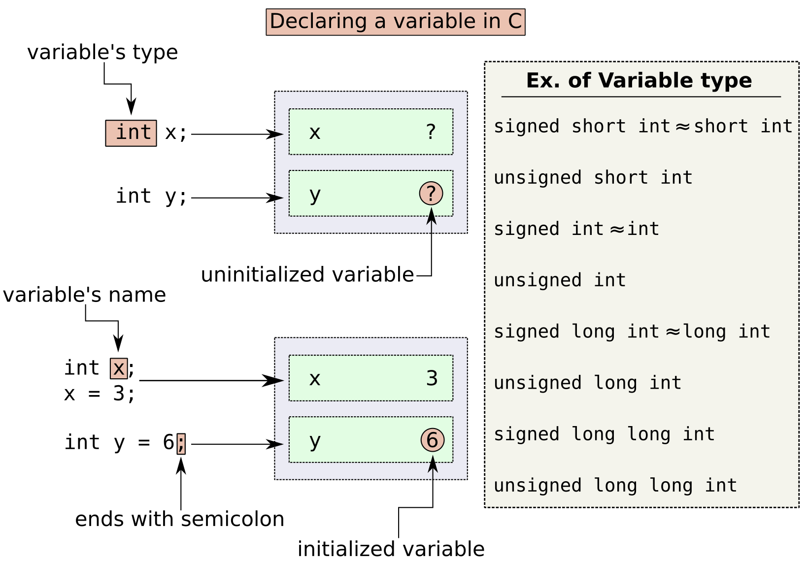

# Introduction

When we think about writing a program in C, the first step is understand how variables should be assigned. There are several variable's type in C, and here we are introducing the type `int`, which is used for integer data types. Basically, we can define a variable as an integer in two ways:
<div class="div-1">
* Uninitialized variable: defined as `int x;`, where no value is assign to the variable $x$ (Figure 1), which generally is not a good idea as it could lead to a bug in the algorithm if no value is assign over the code. 
* Initialized variable: there are two ways to assign a value to a variable $x$ (Figure 1):
  <div class = "div-2">
    * in a single declaration -  `int x = 3;`
    * in a double step declaration - `int x;` and `x = 3;`
  </div>
</div>

```{r,echo=FALSE,fig.cap="Declaring variables in C",fig.height=6, fig.width=6, fig.align='center'}

```

Additionally, there are a large set of storage size-specific declarations for a integer, and here we will explain just an initial idea about it. Figure 2 showns the Integer representation of whole numbers or fixed-point numbers (fixed number of digits). Generally, computers use a fixed number of bits to represent them, where commonly used bit-lengths for integers are 8-bit, 16-bit (`short`), 32-bit (`long`) or 64-bit (`long long`). There are two representation schemes for integers called signed integer type (`signed int`) capable of containing the range of values from -32,767 to 32,767, and unsigned integer type (`unsigned int`) containing the range of values from 0 to 65,535 ($32767 \times 2+1$). Therefore, `unsigned` qualifier should be used when we are working with only positive values. 

```{r,echo=FALSE,fig.cap="Integer Representation", fig.align='center'}
knitr::include_graphics('binary_number.png')
```

Furthermore, there are three representation schemes for signed integers called *Sign-Magnitude representation*, *1's Complement representation*, and *2's Complement representation*. The 1’s and the 2’s complements of a binary number are important because they permit different representation for negative numbers. In all of these schemes, positive signed binary numbers starts with value 0 while negative ones starts with value 1 (Figure 3).

```{r,echo=FALSE,fig.cap="Signed binary numbers", fig.align='center'}
knitr::include_graphics('sign_bit.png')
```
Consequently, the disadvantage of signed binary numbers is that there is 1 bit used to store the sign positive or negative while the remaning $n-1$ bits are assign to the range of digits from $-2^{n-1}$ to $2^{n-1}$. If we have 8 bits to represent a signed binary number, we have to use 1 bit for the **sign bit** and 7 bits for the **magnitude bits**:

<div class="div-1">
* Using Sign-Magnitude Representation:
$$-|2^{\left(8-1\right)}-1| \mbox{ to } 2^{\left(8-1\right)}-1 = -127 \mbox{ to } 127$$
* Using 2's Complement Representation:
$$-2^{\left(8-1\right)} \mbox{ to } 2^{\left(8-1\right)}-1 = -128 \mbox{ to } 127$$
</div>
Thus, we can representing the numbers ranging from -128 to 127 using 2's Complement Representation. Probably now you are asking why there is one extra number being accounted when using 2's Complement Representation. The answer can be found in the Figure 4.

```{r,echo=FALSE,fig.cap="Representation schemes of Sign-Magnitude Representation and 2's Complement Representation", fig.align='center'}
knitr::include_graphics('repre_scheme.png')
```

# Examples

## Unsigned int
Supose we are interested in representing a sequence of number $x$ where $x \in \lbrace 0, 1, \ldots, 15\rbrace$. We can assign these numbers as unsigned numbers of 4 bits. Consequently, we have **4 zero** bits associated to describe this numbers because our variable belongs to the interval $[0, 2^{4}−1] \in \mathcal{N}_{0}$. 

```{r, echo=FALSE}
library(kableExtra)
bits <- c("0000", "0001", "0010", "0011", "0100", "0101", "0110", "0111", "1000", "1001","1010","1011","1100","1101","1110","1111")
x <- seq(0,15,1)
knitr::kable(t(data.frame(bits,x)), caption="Representation of numbers from 0 to 15 in 4 bits") %>%
  kable_styling(bootstrap_options = c("striped", "hover")) %>%
  column_spec(1, bold = T, border_right = TRUE)
```

## Signed int

Supose now we are interested in representing a sequence of number $y$ where $y \in \lbrace -7, -6, \ldots,6, 7\rbrace$. We have to assign them as signed numbers using 4 bits because 1 bit will be used for **sign bit** and 3 bits for the **magnitude bits** to describe $y \in \left[-|2^3-1|,2^3-1\right] \in \mathcal{Z}$.

```{r, echo=FALSE}
library(kableExtra)
bits <- c("0111", "0110", "0101", "0100", "0011", "0010", "0001", "0000", "1000", "1001","1010","1011","1100","1101","1110","1111")
y <- c(seq(7,0,-1), paste("-0"), seq(-1,-7,-1))
knitr::kable(t(data.frame(bits,y)), caption="Sign-Magnitude Representation of numbers from -7 to 7 using 4 bits") %>%
  kable_styling(bootstrap_options = c("striped", "hover")) %>%
  column_spec(1, bold = T, border_right = TRUE)
```

```{r, echo=FALSE}
library(kableExtra)
b1 <- gl(2,2^3, labels = c("0","1"))
b2 <- rep(gl(2,2^2, labels = c("0","1")),2)
b3 <- rep(gl(2,2^1, labels = c("0","1")),4)
b4 <- rep(gl(2,2^0, labels = c("0","1")),8)
bits <- paste0(b1,b2,b3,b4)
y <- c(seq(0,7,1), seq(-8,-1,1))
data <- data.frame(bits,y)
data <- data[order(y),]
knitr::kable(t(data), caption="2's Complement Representation of numbers from -8 to 7 using 4 bits") %>%
  kable_styling(bootstrap_options = c("striped", "hover")) %>%
  column_spec(1, bold = T, border_right = TRUE)
```

# References

Barnett R.; O'Cull L.; Cox, S. Embedded C Programming and the Microship PIC. Delmar Learning, ed. 1, 2004.

Cadenhead, R.; Liberty, J. Sams Teach Yoirself C++. Pearson Education, ed. 6, 2017.

C Data Types - https://en.wikipedia.org/wiki/C_data_types

